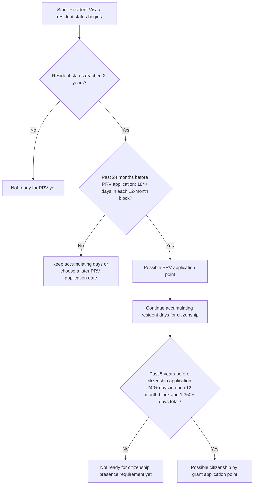

# Corrected New Zealand RV PRV Citizenship Custom Frames Note
> 修正版：新西兰 RV、PRV 与入籍 Custom Frames 笔记

## HTML Artifact
Open the HTML artifact below. The iframe works as a direct fallback; the Custom Frames block is kept for desktop setups where the plugin transforms `custom-frames` code blocks.
> 在下方打开 HTML artifact。`iframe` 是直接备用方案；Custom Frames 代码块保留给桌面端插件能转换 `custom-frames` 代码块的场景。

<iframe src="https://www.lucasgou.cloud/second-brain-html/20260517_mcp_corrected-new-zealand-rv-prv-citizenship-custom-frames-note.html" style="width:100%;height:760px;border:1px solid #d0d7de;border-radius:8px;background:#fff;" loading="lazy"></iframe>

If the iframe is hidden by your Obsidian client, open the direct artifact URL.
> 如果你的 Obsidian 客户端隐藏了 iframe，请打开直接 artifact 链接。

```custom-frames
frame: Second Brain HTML
style: height: 760px;
urlSuffix: /20260517_mcp_corrected-new-zealand-rv-prv-citizenship-custom-frames-note.html
```

Direct artifact URL: https://www.lucasgou.cloud/second-brain-html/20260517_mcp_corrected-new-zealand-rv-prv-citizenship-custom-frames-note.html
> 直接访问 artifact：https://www.lucasgou.cloud/second-brain-html/20260517_mcp_corrected-new-zealand-rv-prv-citizenship-custom-frames-note.html

## Summary
Corrected replacement for the earlier Custom Frames note. The content focuses only on the confirmed New Zealand RV to PRV to citizenship timing rules, with PRV, citizenship, backward-counting logic, and a 2024-07-01 example timeline.
> 对上一版 Custom Frames 笔记的修正版。内容只保留已确认的新西兰 RV 到 PRV 再到国籍时间规则，包括 PRV、入籍、倒推算法和 2024-07-01 示例时间线。

## Knowledge
# Corrected New Zealand RV → PRV → Citizenship Custom Frames Note

This note corrects the earlier page: `20260517_mcp_new-zealand-rv-prv-citizenship-obsidian-note-with-custom-frames-embed`.

The previous version mixed too much generated artifact/iframe explanation and made the content confusing. This corrected version keeps the knowledge layer simple and lets the paired HTML artifact show the visual flow.

## Core answer

- PRV is not available merely because the second year reaches day 184.
- For PRV, the key test is normally:
  1. Resident status has reached 2 years; and
  2. In the 24 months immediately before the PRV application date, each of the two 12-month periods has at least 184 days in New Zealand as a resident.
- Citizenship is not normally counted from PRV. RV/resident time can usually count.
- For citizenship by grant, the key presence test is normally:
  1. Look back 5 years from the citizenship application date;
  2. Each 12-month period must have at least 240 days in New Zealand as a resident;
  3. The full 5-year period must have at least 1,350 days in New Zealand as a resident.

## Visual flow content for the HTML artifact

Use this as the logic of the embedded flowchart:



## PRV backward-counting algorithm

1. Pick a planned PRV application date.
2. Check whether resident status has reached 2 years by that date.
3. Count backward 12 months from that application date.
4. Check whether that first 12-month period has 184+ resident days in New Zealand.
5. Count backward the previous 12 months.
6. Check whether that second 12-month period has 184+ resident days in New Zealand.
7. Only if all of the above are true is the PRV timing normally strong.

## Citizenship backward-counting algorithm

1. Pick a planned citizenship application date.
2. Count backward 5 years from that date.
3. Split the 5-year window into five 12-month periods.
4. Check whether every 12-month period has 240+ resident days in New Zealand.
5. Check whether the total across the 5 years is 1,350+ resident days in New Zealand.
6. Then separately check other citizenship requirements: character, English, intent to continue living in New Zealand, and ceremony/approval steps.

## Example timeline

Assumption: RV was granted while the person was already in New Zealand, so the resident-status clock starts on the RV grant date.

| Date / period | Meaning | Requirement |
|---|---|---|
| 2024-07-01 | RV granted; resident clock starts | Start counting resident time |
| 2024-07-01 to 2025-06-30 | PRV first 12-month block | Need 184+ resident days in New Zealand |
| 2025-07-01 to 2026-06-30 | PRV second 12-month block | Need 184+ resident days in New Zealand |
| 2026-07-01 | Earliest typical PRV application point | Only if both PRV blocks have 184+ days |
| 2024-07-01 to 2029-06-30 | Citizenship 5-year window | Need 240+ days in each 12-month block and 1,350+ days total |
| Around 2029-07-01 | Possible citizenship application point | Only if presence and other citizenship requirements are met |

## Mistakes to avoid

- Mistake 1: Thinking the second-year 184th day alone is enough for PRV. It is not if the 2-year resident-status anniversary has not arrived.
- Mistake 2: Thinking citizenship starts from PRV. In most normal cases, RV/resident time can count.
- Mistake 3: Counting by calendar years. The safer method is always to count backward from the intended application date.

## Custom Frames setup

The second-brain system should generate a paired HTML artifact for this page and display it through the Custom Frames frame named `Second Brain HTML`.

If using a local HTML file instead, point Custom Frames to the file or a localhost URL. The frame content should be this corrected flow: RV start → resident 2-year check → PRV 184/184 check → PRV node → citizenship 240×5 and 1,350 check → citizenship node.
> # 修正版：新西兰 RV → PRV → 国籍 Custom Frames 笔记
>
> 本页用于修正之前这篇笔记：`20260517_mcp_new-zealand-rv-prv-citizenship-obsidian-note-with-custom-frames-embed`。
>
> 上一版混入了太多自动生成的 artifact / iframe 说明，导致内容不清晰。这一版只保留正确知识结构，让配套 HTML artifact 负责可视化展示。
>
> ## 核心结论
>
> - PRV 不是“第二年住满第 184 天”就一定可以申请。
> - PRV 通常要看两个条件：
>   1. resident 身份已经满 2 年；并且
>   2. 从 PRV 申请日往前倒推 24 个月，两个 12 个月区间各自都有至少 184 天在新西兰以 resident 身份居住。
> - 国籍通常不是从 PRV 开始重新算。RV/resident 时间通常可以计入入籍 5 年。
> - Citizenship by grant 的居住天数通常看：
>   1. 从国籍申请日往前倒推 5 年；
>   2. 每个 12 个月区间至少 240 天在新西兰以 resident 身份居住；
>   3. 5 年总计至少 1,350 天在新西兰以 resident 身份居住。
>
> ## HTML artifact 应展示的流程逻辑
>
> 嵌入流程图应按这个逻辑展示：
>
> ```mermaid
> flowchart TD
>     A[起点：拿到 Resident Visa / 开始 resident 身份] --> B{resident 身份是否已经满 2 年？}
>     B -- 否 --> B1[通常还不能申请 PRV]
>     B -- 是 --> C{PRV 申请日前过去 24 个月，两个 12 个月区间是否各有 184+ 天？}
>     C -- 否 --> C1[继续累计天数，或选择更晚的 PRV 申请日重新倒推]
>     C -- 是 --> D[可能达到 PRV 申请节点]
>     D --> E[继续累计入籍所需 resident 天数]
>     E --> F{国籍申请日前过去 5 年，是否每个 12 个月区间 240+ 天，且总计 1,350+ 天？}
>     F -- 否 --> F1[通常还没达到入籍居住天数要求]
>     F -- 是 --> G[可能达到 citizenship by grant 申请节点]
> ```
>
> ## PRV 倒推算法
>
> 1. 先选一个计划递交 PRV 的日期。
> 2. 确认到这一天时，resident 身份是否已经满 2 年。
> 3. 从这个申请日往前倒推 12 个月。
> 4. 检查第一个 12 个月区间是否有 184+ resident 天在新西兰。
> 5. 再往前倒推第二个 12 个月区间。
> 6. 检查第二个 12 个月区间是否也有 184+ resident 天在新西兰。
> 7. 以上都满足，PRV 时间节点通常才比较稳。
>
> ## 国籍倒推算法
>
> 1. 先选一个计划递交国籍申请的日期。
> 2. 从这个日期往前倒推 5 年。
> 3. 把这 5 年拆成五个 12 个月区间。
> 4. 检查每个 12 个月区间是否都有 240+ resident 天在新西兰。
> 5. 检查 5 年总计是否有 1,350+ resident 天在新西兰。
> 6. 再另外检查其他入籍要求：品行、英语、继续在新西兰生活的意图，以及审批和宣誓/入籍仪式。
>
> ## 示例时间线
>
> 假设：人在新西兰境内获批 RV，因此 resident 计时从 RV 批签日开始。
>
> | 日期 / 区间 | 含义 | 需要满足什么 |
> |---|---|---|
> | 2024-07-01 | RV 获批，resident 计时开始 | 开始累计 resident 时间 |
> | 2024-07-01 到 2025-06-30 | PRV 第一个 12 个月区间 | 需要 184+ resident 天在新西兰 |
> | 2025-07-01 到 2026-06-30 | PRV 第二个 12 个月区间 | 需要 184+ resident 天在新西兰 |
> | 2026-07-01 | 最早常见 PRV 申请节点 | 两个 PRV 区间都满足 184+ 天才稳 |
> | 2024-07-01 到 2029-06-30 | 国籍 5 年观察窗口 | 每个 12 个月区间 240+ 天，且 5 年总计 1,350+ 天 |
> | 约 2029-07-01 | 可能达到最早国籍申请节点 | 仍需满足其他入籍条件 |
>
> ## 避免误区
>
> - 误区 1：以为第二年住满第 184 天就一定可以申请 PRV。只要 resident 满 2 年周年日还没到，通常仍不稳。
> - 误区 2：以为入籍 5 年从 PRV 才开始算。多数正常情况下，RV/resident 时间可以算。
> - 误区 3：按自然年粗算。更稳的方式是永远从计划申请日往前倒推。
>
> ## Custom Frames 设置
>
> second-brain 系统会为本页生成配套 HTML artifact，并通过名为 `Second Brain HTML` 的 Custom Frames frame 展示。
>
> 如果你使用本地 HTML 文件，也可以让 Custom Frames 指向本地文件或 localhost URL。frame 里展示的内容应该是这套修正后的流程：RV 起点 → resident 满 2 年判断 → PRV 184/184 判断 → PRV 节点 → 国籍 240×5 和 1,350 判断 → 国籍节点。

## Related
[[20260517_mcp_new-zealand-rv-prv-citizenship-obsidian-note-with-custom-frames-embed]], [[20260517_mcp_new-zealand-rv-prv-citizenship-obsidian-mermaid-note]], [[20260517_mcp_new-zealand-rv-to-prv-and-citizenship-timing-notes]]
> 相关页面：[[20260517_mcp_new-zealand-rv-prv-citizenship-obsidian-note-with-custom-frames-embed]], [[20260517_mcp_new-zealand-rv-prv-citizenship-obsidian-mermaid-note]], [[20260517_mcp_new-zealand-rv-to-prv-and-citizenship-timing-notes]]
