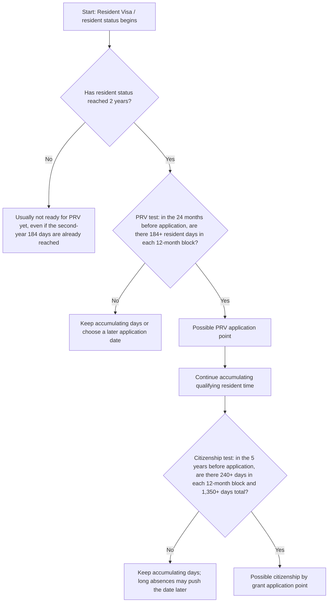
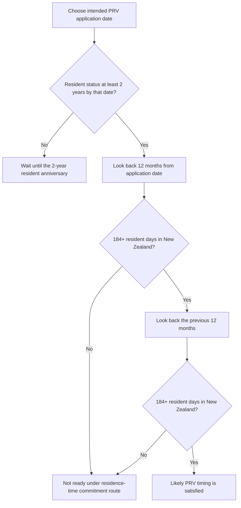
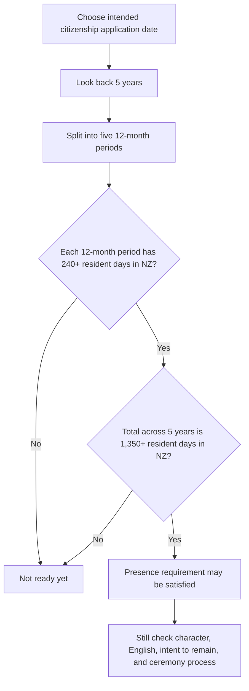

# New Zealand RV PRV Citizenship Obsidian Mermaid Note
> 新西兰 RV、PRV 与入籍 Obsidian 流程图笔记

## HTML Artifact
Open the HTML artifact below. The iframe works as a direct fallback; the Custom Frames block is kept for desktop setups where the plugin transforms `custom-frames` code blocks.
> 在下方打开 HTML artifact。`iframe` 是直接备用方案；Custom Frames 代码块保留给桌面端插件能转换 `custom-frames` 代码块的场景。

<iframe src="https://www.lucasgou.cloud/second-brain-html/20260517_mcp_new-zealand-rv-prv-citizenship-obsidian-mermaid-note.html" style="width:100%;height:760px;border:1px solid #d0d7de;border-radius:8px;background:#fff;" loading="lazy"></iframe>

If the iframe is hidden by your Obsidian client, open the direct artifact URL.
> 如果你的 Obsidian 客户端隐藏了 iframe，请打开直接 artifact 链接。

```custom-frames
frame: Second Brain HTML
style: height: 760px;
urlSuffix: /20260517_mcp_new-zealand-rv-prv-citizenship-obsidian-mermaid-note.html
```

Direct artifact URL: https://www.lucasgou.cloud/second-brain-html/20260517_mcp_new-zealand-rv-prv-citizenship-obsidian-mermaid-note.html
> 直接访问 artifact：https://www.lucasgou.cloud/second-brain-html/20260517_mcp_new-zealand-rv-prv-citizenship-obsidian-mermaid-note.html

## Summary
An Obsidian-friendly Markdown note using Mermaid flowcharts, callouts, tables, and timelines for New Zealand Resident Visa, Permanent Resident Visa, and citizenship timing rules.
> 一版适合 Obsidian 打开的 Markdown + Mermaid 流程图笔记，用流程图、callout、表格和时间线整理新西兰 RV、PRV 与入籍时间节点。

## Knowledge
# New Zealand RV to PRV to Citizenship: Obsidian Flowchart Note

> # 新西兰 RV 到 PRV 再到国籍：Obsidian 流程图笔记

> [!info] Checked date
> Checked on 2026-05-17 against official New Zealand immigration/government guidance. Use this as a planning note, not legal advice.

> > [!info] 核对日期
> > 本笔记按 2026-05-17 核对的新西兰移民局/新西兰政府官方规则整理。用于规划，不替代法律或移民建议。

## One-line memory

> ## 一句话速记

> [!tip]
> **PRV** = 2 years as resident + 184 days in each of the two immediately preceding 12-month periods.  
> **Citizenship** = 5 years qualifying resident status + 240 days in each 12-month period + 1,350 days total.  
> **PRV does not normally reset the citizenship clock. RV/resident time can count.**

> > [!tip]
> > **PRV** = resident 身份满 2 年 + 申请日前倒推两个 12 个月区间各 184 天。  
> > **国籍** = 过去 5 年合格 resident 身份 + 每个 12 个月区间 240 天 + 5 年合计 1,350 天。  
> > **PRV 通常不会重置国籍 5 年计时；RV/resident 时间通常可以算。**

## Main decision flow

> ## 总流程图



> ```mermaid
> flowchart TD
>     A[起点：拿到 Resident Visa / 开始 resident 身份] --> B{resident 身份是否已满 2 年？}
>     B -- 否 --> B1[通常还不能申请 PRV，即使第二年已经住满 184 天]
>     B -- 是 --> C{PRV 检查：申请日前过去 24 个月，两个 12 个月区间是否各有 184+ 天？}
>     C -- 否 --> C1[继续累计天数，或选择更晚的申请日重新倒推]
>     C -- 是 --> D[可能达到 PRV 申请时间点]
>     D --> E[继续累计合格 resident 时间]
>     E --> F{国籍检查：申请日前过去 5 年，是否每个 12 个月区间 240+ 天，且总计 1,350+ 天？}
>     F -- 否 --> F1[继续累计天数；长期离境可能推迟申请时间]
>     F -- 是 --> G[可能达到 citizenship by grant 申请时间点]
> ```

## PRV backward-counting flow

> ## PRV 倒推流程图



> ```mermaid
> flowchart TD
>     A[选择一个计划递交 PRV 的日期] --> B{到这一天是否已经 resident 满 2 年？}
>     B -- 否 --> X[先等到 resident 身份满 2 年周年日]
>     B -- 是 --> C[从申请日往前倒推 12 个月]
>     C --> D{这个 12 个月区间是否有 184+ resident 天在新西兰？}
>     D -- 否 --> Y[通常还不满足居住时间 commitment 路径]
>     D -- 是 --> E[再往前倒推第二个 12 个月区间]
>     E --> F{第二个 12 个月区间是否有 184+ resident 天在新西兰？}
>     F -- 否 --> Y
>     F -- 是 --> Z[PRV 时间条件通常比较稳]
> ```

## Citizenship backward-counting flow

> ## 国籍倒推流程图



> ```mermaid
> flowchart TD
>     A[选择一个计划递交国籍申请的日期] --> B[从该日往前倒推 5 年]
>     B --> C[拆成五个 12 个月区间]
>     C --> D{每个 12 个月区间是否都有 240+ resident 天在新西兰？}
>     D -- 否 --> X[通常还没达到 presence requirement]
>     D -- 是 --> E{5 年总计是否有 1,350+ resident 天在新西兰？}
>     E -- 否 --> X
>     E -- 是 --> F[居住天数要求可能满足]
>     F --> G[继续检查品行、英语、继续居住意图、宣誓/入籍仪式等]
> ```

## Key day-count table

> ## 关键天数速查表

| Stage | Observation window | Day-count rule | Main trap |
|---|---|---|---|
| RV to PRV | Resident status must usually reach 2 years first; then look back 24 months from the PRV application date | 184+ days in each of the two 12-month blocks | Thinking the second-year 184th day alone is enough before the 2-year anniversary |
| RV/PRV to citizenship | Look back 5 years from the citizenship application date | 240+ days in each 12-month block and 1,350+ days total | Thinking the 5-year clock starts only after PRV |

> | 阶段 | 观察窗口 | 天数规则 | 常见误区 |
> |---|---|---|---|
> | RV 到 PRV | 先看 resident 身份是否满 2 年；再从 PRV 申请日往前倒推 24 个月 | 两个 12 个月区间，每个区间 184+ 天 | 以为第二年住满第 184 天就一定能立刻申请；其实 resident 满 2 年仍是门槛 |
> | RV/PRV 到国籍 | 从国籍申请日往前倒推 5 年 | 每个 12 个月区间 240+ 天，并且 5 年总计 1,350+ 天 | 以为国籍 5 年从 PRV 才开始算；通常 RV/resident 时间可以计入 |

## Example timeline

> ## 示例时间线

Assumption: RV was granted while already in New Zealand, so the resident clock starts on the RV grant date.

> 假设：人在新西兰境内获批 RV，因此 resident 计时从 RV 批签日开始。

| Date / period | What happens | Requirement |
|---|---|---|
| 2024-07-01 | RV granted; resident-status clock starts | Start counting resident time |
| 2024-07-01 to 2025-06-30 | PRV block 1 | Need 184+ resident days in NZ |
| 2025-07-01 to 2026-06-30 | PRV block 2 | Need 184+ resident days in NZ |
| 2026-07-01 | Earliest typical PRV application point | Only if both 184-day blocks are satisfied |
| 2024-07-01 to 2029-06-30 | Citizenship 5-year window | Need 240+ days in each 12-month block and 1,350+ total |
| Around 2029-07-01 | Possible citizenship application point | Only if all presence and other requirements are met |

> | 日期 / 区间 | 发生什么 | 需要满足什么 |
> |---|---|---|
> | 2024-07-01 | RV 获批，resident 身份计时开始 | 开始累计 resident 时间 |
> | 2024-07-01 到 2025-06-30 | PRV 第一个 12 个月区间 | 需要 184+ resident 天在新西兰 |
> | 2025-07-01 到 2026-06-30 | PRV 第二个 12 个月区间 | 需要 184+ resident 天在新西兰 |
> | 2026-07-01 | 最早常见 PRV 申请点 | 前两个 12 个月区间都满足 184+ 天才稳 |
> | 2024-07-01 到 2029-06-30 | 国籍 5 年观察窗口 | 每个 12 个月区间 240+ 天，且总计 1,350+ 天 |
> | 约 2029-07-01 | 可能达到最早国籍申请点 | 还要满足其他入籍条件 |

## Misunderstandings to avoid

> ## 避免这些误解

> [!warning]
> **PRV misunderstanding:** The second-year 184th day is not enough by itself. The resident-status 2-year anniversary still matters.

> > [!warning]
> > **PRV 误解：** 第二年住满第 184 天本身不够。resident 身份满 2 年这个周年日仍然重要。

> [!warning]
> **Citizenship misunderstanding:** Getting PRV does not normally restart the 5-year citizenship clock. RV/resident time can usually count.

> > [!warning]
> > **国籍误解：** 拿到 PRV 通常不会重置国籍 5 年计时。RV/resident 时间通常可以算。

> [!warning]
> **Counting misunderstanding:** Do not count only by calendar years. Count backward from the actual intended application date.

> > [!warning]
> > **计数误解：** 不要只按自然年算。要从实际计划申请日往前倒推。

## Re-check official rules if any of these apply

> ## 出现这些情况时应重新核对官方规则

- RV was granted offshore.
- Travel conditions expired or are close to expiry.
- The RV has special conditions or conditions not yet satisfied.
- There were long absences from New Zealand.
- The application is close to the minimum day thresholds.
- Policy has changed since this note was last checked.

> - RV 是在新西兰境外获批的。
> - travel conditions 已过期或接近过期。
> - RV 有特殊条件，或条件尚未满足。
> - 中间有长期离境。
> - 申请时间非常贴近最低天数门槛。
> - 本笔记核对后，政策发生变化。

## Related
[[20260517_mcp_new-zealand-rv-to-prv-and-citizenship-timing-notes]], [[20260517_mcp_new-zealand-rv-prv-citizenship-flowchart-html-note]]
> 相关页面：[[20260517_mcp_new-zealand-rv-to-prv-and-citizenship-timing-notes]], [[20260517_mcp_new-zealand-rv-prv-citizenship-flowchart-html-note]]
