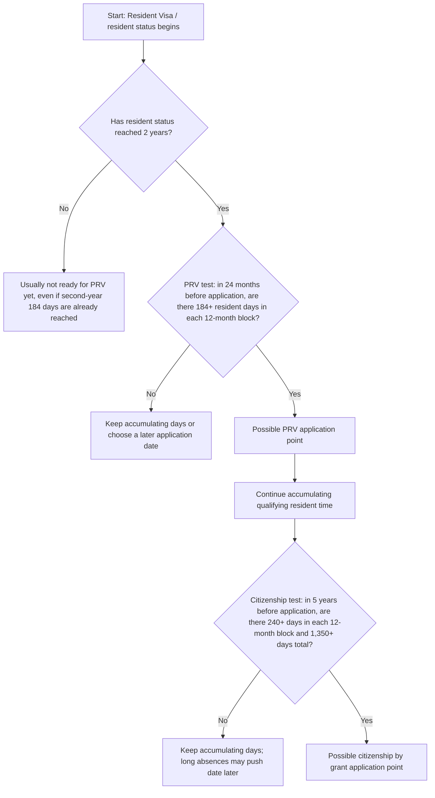

# New Zealand RV PRV Citizenship Obsidian Note with Custom Frames Embed
> 新西兰 RV、PRV 与入籍 Obsidian Custom Frames 嵌入版笔记

## HTML Artifact
Open the interactive HTML artifact in Obsidian through Custom Frames.
> 通过 Custom Frames 在 Obsidian 中打开交互式 HTML artifact。

```custom-frames
frame: Second Brain HTML
style: height: 760px;
urlSuffix: /20260517_mcp_new-zealand-rv-prv-citizenship-obsidian-note-with-custom-frames-embed.html
```

Direct artifact URL: https://www.lucasgou.cloud/second-brain-html/20260517_mcp_new-zealand-rv-prv-citizenship-obsidian-note-with-custom-frames-embed.html
> 直接访问 artifact：https://www.lucasgou.cloud/second-brain-html/20260517_mcp_new-zealand-rv-prv-citizenship-obsidian-note-with-custom-frames-embed.html

## Summary
An Obsidian-friendly note that embeds a generated standalone HTML artifact through the Second Brain HTML Custom Frames frame, while keeping Markdown and Mermaid fallback content for editing, search, and long-term maintenance.
> 一版适合 Obsidian 的 Custom Frames 笔记：通过 Second Brain HTML frame 嵌入生成的独立 HTML artifact，同时保留 Markdown 和 Mermaid 备用内容，方便编辑、搜索和长期维护。

## Knowledge
## Purpose

This note is the Obsidian Custom Frames version of the New Zealand RV to PRV to citizenship timing reference. It should be read as a personal planning aid, not legal advice. Immigration rules can change, and final eligibility should be checked against Immigration New Zealand and the Department of Internal Affairs before acting.

## How to read the embedded artifact

The Markdown note keeps the editable, searchable version of the rules. The paired HTML artifact renders the same logic as a visual reading surface through the `Second Brain HTML` Custom Frames frame. In Obsidian, the Custom Frames block near the top of this note should load the hosted HTML artifact directly from the second-brain server.

## One-line memory

PRV usually depends on holding resident status for 2 years and meeting the 184-day presence test in each of the two immediately preceding 12-month periods. Citizenship by grant usually depends on 5 years of qualifying resident status, at least 240 days in each 12-month period, and at least 1,350 days in total. PRV does not normally reset the citizenship clock; RV/resident time can count.

## Mermaid fallback



## Key day-count table

| Stage | Observation window | Day-count rule | Main trap |
|---|---|---|---|
| RV to PRV | Resident status must usually reach 2 years first; then look back 24 months from the PRV application date | 184+ days in each of the two 12-month blocks | Thinking the second-year 184th day alone is enough before the 2-year anniversary |
| RV/PRV to citizenship | Look back 5 years from the citizenship application date | 240+ days in each 12-month block and 1,350+ days total | Thinking the 5-year clock starts only after PRV |

## Example timeline

Assumption: RV was granted while already in New Zealand, so the resident clock starts on the RV grant date.

| Date / period | What happens | Requirement |
|---|---|---|
| 2024-07-01 | RV granted; resident-status clock starts | Start counting resident time |
| 2024-07-01 to 2025-06-30 | PRV block 1 | Need 184+ resident days in New Zealand |
| 2025-07-01 to 2026-06-30 | PRV block 2 | Need 184+ resident days in New Zealand |
| 2026-07-01 | Earliest typical PRV application point | Only if both 184-day blocks are satisfied |
| 2024-07-01 to 2029-06-30 | Citizenship 5-year window | Need 240+ days in each 12-month block and 1,350+ total |
| Around 2029-07-01 | Possible citizenship application point | Only if all presence and other requirements are met |

## If the Custom Frames embed does not show

Confirm that the Obsidian Custom Frames plugin is enabled. Confirm that a frame named `Second Brain HTML` exists and uses `https://www.lucasgou.cloud/second-brain-html` as its base URL. The note appends the generated HTML filename through `urlSuffix`, so no local `file://` setup is needed.
> ## 目的
>
> 这篇笔记是“新西兰 RV 到 PRV 再到入籍时间判断”的 Obsidian Custom Frames 版本。它适合作为个人规划辅助，不构成法律建议。移民规则可能变化，实际行动前应以 Immigration New Zealand 和 Department of Internal Affairs 的最新规则为准。
>
> ## 如何阅读嵌入 artifact
>
> Markdown 笔记保留可编辑、可搜索的规则版本。配套 HTML artifact 会把同一套逻辑渲染成可视化阅读界面，并通过 `Second Brain HTML` 这个 Custom Frames frame 在 Obsidian 中显示。笔记顶部附近的 Custom Frames 代码块会直接从 second-brain 服务器加载托管的 HTML artifact。
>
> ## 一句话速记
>
> PRV 通常取决于 resident 身份满 2 年，并且在申请日前倒推的两个 12 个月区间中各满足 184 天居住要求。Citizenship by grant 通常取决于 5 年合格 resident 身份、每个 12 个月区间至少 240 天、5 年合计至少 1,350 天。PRV 通常不会重置入籍 5 年计时；RV/resident 时间可以计入。
>
> ## Mermaid 备用流程图
>
> ```mermaid
> flowchart TD
>     A[起点：拿到 Resident Visa / 开始 resident 身份] --> B{resident 身份是否已满 2 年？}
>     B -- 否 --> B1[通常还不能申请 PRV，即使第二年已经住满 184 天]
>     B -- 是 --> C{PRV 检查：申请日前过去 24 个月，两个 12 个月区间是否各有 184+ 天？}
>     C -- 否 --> C1[继续累计天数，或选择更晚的申请日重新倒推]
>     C -- 是 --> D[可能达到 PRV 申请时间点]
>     D --> E[继续累计合格 resident 时间]
>     E --> F{国籍检查：申请日前过去 5 年，是否每个 12 个月区间 240+ 天，且总计 1,350+ 天？}
>     F -- 否 --> F1[继续累计天数；长期离境可能推迟申请时间]
>     F -- 是 --> G[可能达到 citizenship by grant 申请时间点]
> ```
>
> ## 关键天数速查表
>
> | 阶段 | 观察窗口 | 天数规则 | 常见误区 |
> |---|---|---|---|
> | RV 到 PRV | 通常先看 resident 身份是否满 2 年；再从 PRV 申请日往前倒推 24 个月 | 两个 12 个月区间各 184+ 天 | 以为第二年住满第 184 天就一定能在两周年前申请 |
> | RV/PRV 到入籍 | 从入籍申请日往前倒推 5 年 | 每个 12 个月区间 240+ 天，并且 5 年总计 1,350+ 天 | 以为入籍 5 年只从 PRV 开始算 |
>
> ## 示例时间线
>
> 假设：人在新西兰境内获批 RV，因此 resident 计时从 RV 批签日开始。
>
> | 日期 / 区间 | 发生什么 | 需要满足什么 |
> |---|---|---|
> | 2024-07-01 | RV 获批，resident 身份计时开始 | 开始累计 resident 时间 |
> | 2024-07-01 到 2025-06-30 | PRV 第一个 12 个月区间 | 需要 184+ resident 天在新西兰 |
> | 2025-07-01 到 2026-06-30 | PRV 第二个 12 个月区间 | 需要 184+ resident 天在新西兰 |
> | 2026-07-01 | 最早常见 PRV 申请点 | 前两个 12 个月区间都满足 184+ 天才稳 |
> | 2024-07-01 到 2029-06-30 | 入籍 5 年观察窗口 | 每个 12 个月区间 240+ 天，且总计 1,350+ 天 |
> | 约 2029-07-01 | 可能达到最早入籍申请点 | 还要满足其他入籍条件 |
>
> ## 如果 Custom Frames 嵌入没有显示
>
> 确认 Obsidian 的 Custom Frames 插件已启用。确认存在名为 `Second Brain HTML` 的 frame，并且基础 URL 是 `https://www.lucasgou.cloud/second-brain-html`。这篇笔记会通过 `urlSuffix` 自动追加生成的 HTML 文件名，所以不再需要本地 `file://` 配置。

## Related
[[20260517_mcp_new-zealand-rv-prv-citizenship-obsidian-mermaid-note]], [[20260517_mcp_new-zealand-rv-prv-citizenship-flowchart-html-note]], [[20260517_mcp_new-zealand-rv-to-prv-and-citizenship-timing-notes]]
> 相关页面：[[20260517_mcp_new-zealand-rv-prv-citizenship-obsidian-mermaid-note]], [[20260517_mcp_new-zealand-rv-prv-citizenship-flowchart-html-note]], [[20260517_mcp_new-zealand-rv-to-prv-and-citizenship-timing-notes]]
