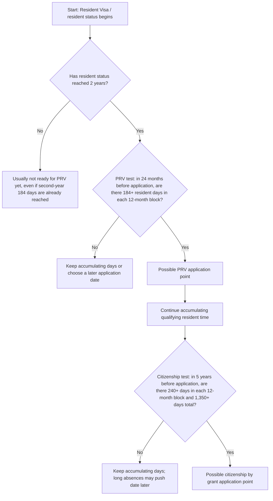

# New Zealand RV PRV Citizenship Obsidian Note with Custom Frames Embed
> 新西兰 RV、PRV 与入籍 Obsidian Custom Frames 嵌入版笔记

<section class="second-brain-html-note" style="border:1px solid #d0d7de;border-radius:8px;margin:18px 0;padding:18px;background:#ffffff;color:#111827;font-family:-apple-system,BlinkMacSystemFont,'Segoe UI',sans-serif;">
  <header style="display:grid;gap:8px;border-bottom:1px solid #e5e7eb;padding-bottom:14px;margin-bottom:14px;">
    <div style="font-size:12px;font-weight:700;letter-spacing:0;text-transform:uppercase;color:#64748b;">Second Brain Note</div>
    <h2 style="margin:0;font-size:24px;line-height:1.2;color:#0f172a;">New Zealand RV PRV Citizenship Obsidian Note with Custom Frames Embed</h2>
    <blockquote style="margin:0;padding-left:12px;border-left:3px solid #94a3b8;color:#475569;">新西兰 RV、PRV 与入籍 Obsidian Custom Frames 嵌入版笔记</blockquote>
    <div style="display:flex;flex-wrap:wrap;gap:6px;"><span style="display:inline-flex;align-items:center;padding:3px 8px;border:1px solid #cbd5e1;border-radius:999px;background:#f8fafc;font-size:12px;color:#334155;">immigration</span><span style="display:inline-flex;align-items:center;padding:3px 8px;border:1px solid #cbd5e1;border-radius:999px;background:#f8fafc;font-size:12px;color:#334155;">new-zealand</span><span style="display:inline-flex;align-items:center;padding:3px 8px;border:1px solid #cbd5e1;border-radius:999px;background:#f8fafc;font-size:12px;color:#334155;">rv</span><span style="display:inline-flex;align-items:center;padding:3px 8px;border:1px solid #cbd5e1;border-radius:999px;background:#f8fafc;font-size:12px;color:#334155;">prv</span><span style="display:inline-flex;align-items:center;padding:3px 8px;border:1px solid #cbd5e1;border-radius:999px;background:#f8fafc;font-size:12px;color:#334155;">citizenship</span><span style="display:inline-flex;align-items:center;padding:3px 8px;border:1px solid #cbd5e1;border-radius:999px;background:#f8fafc;font-size:12px;color:#334155;">obsidian</span><span style="display:inline-flex;align-items:center;padding:3px 8px;border:1px solid #cbd5e1;border-radius:999px;background:#f8fafc;font-size:12px;color:#334155;">custom-frames</span><span style="display:inline-flex;align-items:center;padding:3px 8px;border:1px solid #cbd5e1;border-radius:999px;background:#f8fafc;font-size:12px;color:#334155;">html-embed</span></div>
  </header>
  <div style="display:grid;grid-template-columns:repeat(auto-fit,minmax(220px,1fr));gap:12px;margin-bottom:14px;">
    <article style="border:1px solid #e5e7eb;border-radius:8px;padding:12px;background:#f8fafc;">
      <h3 style="margin:0 0 8px;font-size:13px;color:#475569;">Summary</h3>
      <p style="margin:0;line-height:1.6;">An Obsidian-friendly note that embeds the generated standalone HTML flowchart through the Custom Frames plugin, while keeping the Mermaid/Markdown fallback structure for editing and search.</p>
      <blockquote style="margin:8px 0 0;padding-left:10px;border-left:3px solid #cbd5e1;color:#475569;">一版适合 Obsidian 的 Custom Frames 嵌入版笔记：顶部嵌入刚生成的 HTML 流程图，同时保留 Mermaid/Markdown 版流程图和速查表，方便搜索、编辑和长期维护。</blockquote>
    </article>
    <article style="border:1px solid #e5e7eb;border-radius:8px;padding:12px;background:#f8fafc;">
      <h3 style="margin:0 0 8px;font-size:13px;color:#475569;">Related</h3>
      <p style="margin:0;line-height:1.6;">[[20260517-mcp-new-zealand-rv-prv-citizenship-obsidian-mermaid-note]], [[20260517-mcp-new-zealand-rv-prv-citizenship-flowchart-html-note]], [[20260517-mcp-new-zealand-rv-to-prv-and-citizenship-timing-notes]]</p>
      <blockquote style="margin:8px 0 0;padding-left:10px;border-left:3px solid #cbd5e1;color:#475569;">相关页面：[[20260517-mcp-new-zealand-rv-prv-citizenship-obsidian-mermaid-note]], [[20260517-mcp-new-zealand-rv-prv-citizenship-flowchart-html-note]], [[20260517-mcp-new-zealand-rv-to-prv-and-citizenship-timing-notes]]</blockquote>
    </article>
  </div>
  <details open style="border:1px solid #e5e7eb;border-radius:8px;padding:12px;background:#fff;">
    <summary style="cursor:pointer;font-weight:700;color:#0f172a;">Knowledge Body / 知识正文</summary>
    <div style="margin-top:12px;">
      <p style="margin:0 0 10px;line-height:1.65;"># New Zealand RV → PRV → Citizenship: Obsidian Custom Frames Embed</p>
<p style="margin:0 0 10px;line-height:1.65;">&gt; [!info] Purpose
&gt; This note is designed for Obsidian with the Custom Frames plugin installed. It embeds the standalone HTML flowchart generated earlier, while keeping a Markdown/Mermaid fallback below.</p>
<p style="margin:0 0 10px;line-height:1.65;">## 1. Embedded HTML flowchart</p>
<p style="margin:0 0 10px;line-height:1.65;">&gt; [!important] Before this renders
&gt; Put the generated HTML file inside the Obsidian vault, for example:
&gt;
&gt; `attachments/nz_rv_prv_citizenship_flowchart.html`
&gt;
&gt; Then create a Custom Frames entry with this exact name:
&gt;
&gt; `NZ RV PRV Flow`
&gt;
&gt; The Custom Frames URL should point to the local HTML file, for example:
&gt;
&gt; `file:///ABSOLUTE/PATH/TO/YOUR/VAULT/attachments/nz_rv_prv_citizenship_flowchart.html`
&gt;
&gt; If `file://` does not render, serve the folder locally and use:
&gt;
&gt; `http://localhost:8787/nz_rv_prv_citizenship_flowchart.html`</p>
<p style="margin:0 0 10px;line-height:1.65;">```custom-frames
frame: NZ RV PRV Flow
style: height: 920px; width: 100%; border: 0;
```</p>
<p style="margin:0 0 10px;line-height:1.65;">## 2. One-line memory</p>
      <blockquote style="margin:12px 0 0;padding-left:12px;border-left:3px solid #94a3b8;color:#475569;">
        <p style="margin:0 0 10px;line-height:1.65;"># 新西兰 RV → PRV → 国籍：Obsidian Custom Frames 嵌入版</p>
<p style="margin:0 0 10px;line-height:1.65;">&gt; [!info] 目的
&gt; 这版笔记专门给已安装 **Custom Frames** 插件的 Obsidian 使用。顶部嵌入刚才生成的独立 HTML 流程图，下面保留 Markdown/Mermaid 版本，方便搜索、编辑和长期维护。</p>
<p style="margin:0 0 10px;line-height:1.65;">## 1. 嵌入 HTML 流程图</p>
<p style="margin:0 0 10px;line-height:1.65;">&gt; [!important] 渲染前需要先做一次配置
&gt; 先把刚才生成的 HTML 文件放进你的 Obsidian vault，例如：
&gt;
&gt; `attachments/nz_rv_prv_citizenship_flowchart.html`
&gt;
&gt; 然后在 Custom Frames 设置里新增一个 frame，名字必须和下面一致：
&gt;
&gt; `NZ RV PRV Flow`
&gt;
&gt; URL 填这个 HTML 文件的本地绝对路径，例如：
&gt;
&gt; `file:///ABSOLUTE/PATH/TO/YOUR/VAULT/attachments/nz_rv_prv_citizenship_flowchart.html`
&gt;
&gt; 如果 `file://` 不显示，就用本地小服务器方式，URL 改成：
&gt;
&gt; `http://localhost:8787/nz_rv_prv_citizenship_flowchart.html`</p>
<p style="margin:0 0 10px;line-height:1.65;">```custom-frames
frame: NZ RV PRV Flow
style: height: 920px; width: 100%; border: 0;
```</p>
<p style="margin:0 0 10px;line-height:1.65;">## 2. 一句话速记</p>
      </blockquote>
    </div>
  </details>
</section>

## Summary
An Obsidian-friendly note that embeds the generated standalone HTML flowchart through the Custom Frames plugin, while keeping the Mermaid/Markdown fallback structure for editing and search.
> 一版适合 Obsidian 的 Custom Frames 嵌入版笔记：顶部嵌入刚生成的 HTML 流程图，同时保留 Mermaid/Markdown 版流程图和速查表，方便搜索、编辑和长期维护。

## Knowledge
# New Zealand RV → PRV → Citizenship: Obsidian Custom Frames Embed

> [!info] Purpose
> This note is designed for Obsidian with the Custom Frames plugin installed. It embeds the standalone HTML flowchart generated earlier, while keeping a Markdown/Mermaid fallback below.

## 1. Embedded HTML flowchart

> [!important] Before this renders
> Put the generated HTML file inside the Obsidian vault, for example:
>
> `attachments/nz_rv_prv_citizenship_flowchart.html`
>
> Then create a Custom Frames entry with this exact name:
>
> `NZ RV PRV Flow`
>
> The Custom Frames URL should point to the local HTML file, for example:
>
> `file:///ABSOLUTE/PATH/TO/YOUR/VAULT/attachments/nz_rv_prv_citizenship_flowchart.html`
>
> If `file://` does not render, serve the folder locally and use:
>
> `http://localhost:8787/nz_rv_prv_citizenship_flowchart.html`

```custom-frames
frame: NZ RV PRV Flow
style: height: 920px; width: 100%; border: 0;
```

## 2. One-line memory

> [!tip]
> **PRV** = 2 years as resident + 184 days in each of the two immediately preceding 12-month periods.  
> **Citizenship** = 5 years qualifying resident status + 240 days in each 12-month period + 1,350 days total.  
> **PRV does not normally reset the citizenship clock. RV/resident time can count.**

## 3. Markdown/Mermaid fallback



## 4. Key day-count table

| Stage | Observation window | Day-count rule | Main trap |
|---|---|---|---|
| RV → PRV | Resident status must usually reach 2 years first; then look back 24 months from the PRV application date | 184+ days in each of the two 12-month blocks | Thinking the second-year 184th day alone is enough before the 2-year anniversary |
| RV/PRV → Citizenship | Look back 5 years from the citizenship application date | 240+ days in each 12-month block and 1,350+ days total | Thinking the 5-year clock starts only after PRV |

## 5. Example timeline

Assumption: RV was granted while already in New Zealand, so the resident clock starts on the RV grant date.

| Date / period | What happens | Requirement |
|---|---|---|
| 2024-07-01 | RV granted; resident-status clock starts | Start counting resident time |
| 2024-07-01 → 2025-06-30 | PRV block 1 | Need 184+ resident days in NZ |
| 2025-07-01 → 2026-06-30 | PRV block 2 | Need 184+ resident days in NZ |
| 2026-07-01 | Earliest typical PRV application point | Only if both 184-day blocks are satisfied |
| 2024-07-01 → 2029-06-30 | Citizenship 5-year window | Need 240+ days in each 12-month block and 1,350+ total |
| Around 2029-07-01 | Possible citizenship application point | Only if all presence and other requirements are met |

## 6. If the embedded HTML does not show

1. Confirm the Custom Frames plugin is enabled.
2. Confirm the frame name is exactly `NZ RV PRV Flow`.
3. Confirm the URL points to the HTML file with an absolute path.
4. If `file://` is blocked, use a local server:

```bash
cd /path/to/vault/attachments
python3 -m http.server 8787
```

Then set the Custom Frames URL to:

`http://localhost:8787/nz_rv_prv_citizenship_flowchart.html`
> # 新西兰 RV → PRV → 国籍：Obsidian Custom Frames 嵌入版
>
> > [!info] 目的
> > 这版笔记专门给已安装 **Custom Frames** 插件的 Obsidian 使用。顶部嵌入刚才生成的独立 HTML 流程图，下面保留 Markdown/Mermaid 版本，方便搜索、编辑和长期维护。
>
> ## 1. 嵌入 HTML 流程图
>
> > [!important] 渲染前需要先做一次配置
> > 先把刚才生成的 HTML 文件放进你的 Obsidian vault，例如：
> >
> > `attachments/nz_rv_prv_citizenship_flowchart.html`
> >
> > 然后在 Custom Frames 设置里新增一个 frame，名字必须和下面一致：
> >
> > `NZ RV PRV Flow`
> >
> > URL 填这个 HTML 文件的本地绝对路径，例如：
> >
> > `file:///ABSOLUTE/PATH/TO/YOUR/VAULT/attachments/nz_rv_prv_citizenship_flowchart.html`
> >
> > 如果 `file://` 不显示，就用本地小服务器方式，URL 改成：
> >
> > `http://localhost:8787/nz_rv_prv_citizenship_flowchart.html`
>
> ```custom-frames
> frame: NZ RV PRV Flow
> style: height: 920px; width: 100%; border: 0;
> ```
>
> ## 2. 一句话速记
>
> > [!tip]
> > **PRV** = resident 身份满 2 年 + 申请日前倒推两个 12 个月区间各 184 天。  
> > **国籍** = 过去 5 年合格 resident 身份 + 每个 12 个月区间 240 天 + 5 年合计 1,350 天。  
> > **PRV 通常不会重置国籍 5 年计时；RV/resident 时间通常可以算。**
>
> ## 3. Markdown/Mermaid 备用流程图
>
> ```mermaid
> flowchart TD
>     A[起点：拿到 Resident Visa / 开始 resident 身份] --> B{resident 身份是否已满 2 年？}
>     B -- 否 --> B1[通常还不能申请 PRV，即使第二年已经住满 184 天]
>     B -- 是 --> C{PRV 检查：申请日前过去 24 个月，两个 12 个月区间是否各有 184+ 天？}
>     C -- 否 --> C1[继续累计天数，或选择更晚的申请日重新倒推]
>     C -- 是 --> D[可能达到 PRV 申请时间点]
>     D --> E[继续累计合格 resident 时间]
>     E --> F{国籍检查：申请日前过去 5 年，是否每个 12 个月区间 240+ 天，且总计 1,350+ 天？}
>     F -- 否 --> F1[继续累计天数；长期离境可能推迟申请时间]
>     F -- 是 --> G[可能达到 citizenship by grant 申请时间点]
> ```
>
> ## 4. 关键天数速查表
>
> | 阶段 | 观察窗口 | 天数规则 | 常见误区 |
> |---|---|---|---|
> | RV → PRV | 先看 resident 身份是否满 2 年；再从 PRV 申请日往前倒推 24 个月 | 两个 12 个月区间，每个区间 184+ 天 | 以为第二年住满第 184 天就一定能立刻申请；其实 resident 满 2 年仍是门槛 |
> | RV/PRV → 国籍 | 从国籍申请日往前倒推 5 年 | 每个 12 个月区间 240+ 天，并且 5 年总计 1,350+ 天 | 以为国籍 5 年从 PRV 才开始算；通常 RV/resident 时间可以计入 |
>
> ## 5. 示例时间线
>
> 假设：人在新西兰境内获批 RV，因此 resident 计时从 RV 批签日开始。
>
> | 日期 / 区间 | 发生什么 | 需要满足什么 |
> |---|---|---|
> | 2024-07-01 | RV 获批，resident 身份计时开始 | 开始累计 resident 时间 |
> | 2024-07-01 → 2025-06-30 | PRV 第一个 12 个月区间 | 需要 184+ resident 天在新西兰 |
> | 2025-07-01 → 2026-06-30 | PRV 第二个 12 个月区间 | 需要 184+ resident 天在新西兰 |
> | 2026-07-01 | 最早常见 PRV 申请点 | 前两个 12 个月区间都满足 184+ 天才稳 |
> | 2024-07-01 → 2029-06-30 | 国籍 5 年观察窗口 | 每个 12 个月区间 240+ 天，且总计 1,350+ 天 |
> | 约 2029-07-01 | 可能达到最早国籍申请点 | 还要满足其他入籍条件 |
>
> ## 6. 如果 HTML 没有显示
>
> 1. 确认 Custom Frames 插件已启用。
> 2. 确认 frame 名字完全等于：`NZ RV PRV Flow`。
> 3. 确认 URL 是 HTML 文件的本地绝对路径。
> 4. 如果 `file://` 被拦，用本地服务器：
>
> ```bash
> cd /你的vault/attachments
> python3 -m http.server 8787
> ```
>
> 然后把 Custom Frames 的 URL 改成：
>
> `http://localhost:8787/nz_rv_prv_citizenship_flowchart.html`

## Related
[[20260517-mcp-new-zealand-rv-prv-citizenship-obsidian-mermaid-note]], [[20260517-mcp-new-zealand-rv-prv-citizenship-flowchart-html-note]], [[20260517-mcp-new-zealand-rv-to-prv-and-citizenship-timing-notes]]
> 相关页面：[[20260517-mcp-new-zealand-rv-prv-citizenship-obsidian-mermaid-note]], [[20260517-mcp-new-zealand-rv-prv-citizenship-flowchart-html-note]], [[20260517-mcp-new-zealand-rv-to-prv-and-citizenship-timing-notes]]
