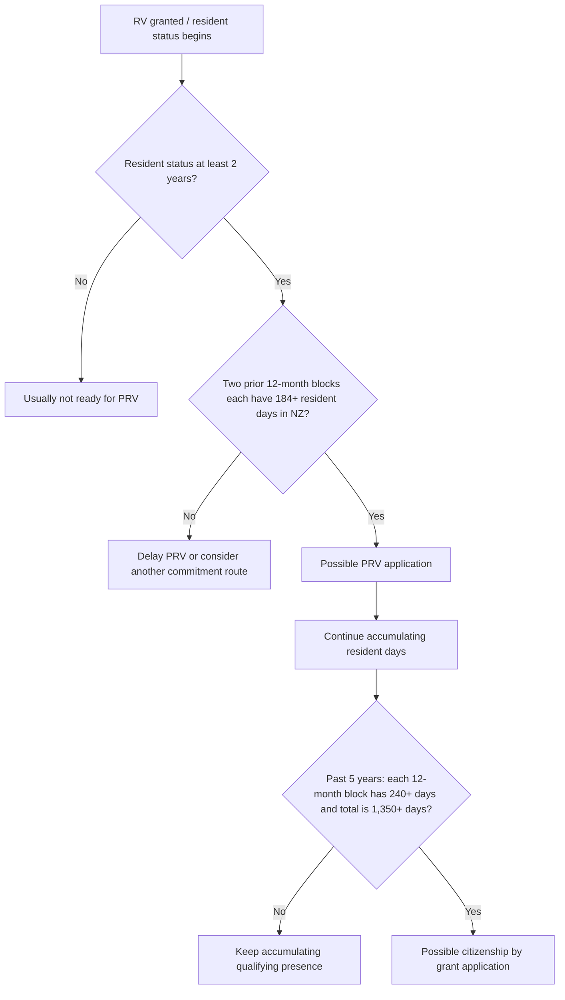

# New Zealand RV to PRV to Citizenship Complete Guide
> 新西兰 RV 到 PRV 再到入籍完整指南

## HTML Artifact
Open the HTML artifact below. The iframe works as a direct fallback; the Custom Frames block is kept for desktop setups where the plugin transforms `custom-frames` code blocks.
> 在下方打开 HTML artifact。`iframe` 是直接备用方案；Custom Frames 代码块保留给桌面端插件能转换 `custom-frames` 代码块的场景。

<iframe src="https://www.lucasgou.cloud/second-brain-html/20260517_mcp_new-zealand-rv-to-prv-to-citizenship-complete-guide.html" style="width:100%;height:760px;border:1px solid #d0d7de;border-radius:8px;background:#fff;" loading="lazy"></iframe>

If the iframe is hidden by your Obsidian client, open the direct artifact URL.
> 如果你的 Obsidian 客户端隐藏了 iframe，请打开直接 artifact 链接。

```custom-frames
frame: Second Brain HTML
style: height: 760px;
urlSuffix: /20260517_mcp_new-zealand-rv-to-prv-to-citizenship-complete-guide.html
```

Direct artifact URL: https://www.lucasgou.cloud/second-brain-html/20260517_mcp_new-zealand-rv-to-prv-to-citizenship-complete-guide.html
> 直接访问 artifact：https://www.lucasgou.cloud/second-brain-html/20260517_mcp_new-zealand-rv-to-prv-to-citizenship-complete-guide.html

## Summary
A structured complete guide for planning the New Zealand pathway from Resident Visa to Permanent Resident Visa and citizenship by grant, covering start dates, PRV 2-year and 184-day rules, alternative PRV commitment paths, travel conditions, citizenship 240-day and 1,350-day presence rules, example timelines, algorithms, and common mistakes.
> 一份用于规划新西兰 Resident Visa 到 Permanent Resident Visa 再到 citizenship by grant 的结构化完整指南，涵盖起算点、PRV 两年与 184 天规则、其他 PRV commitment 路径、travel conditions、入籍 240 天与 1,350 天规则、示例时间线、倒推算法和常见误区。

## Knowledge
# New Zealand RV → PRV → Citizenship: Complete Guide

> # 新西兰 RV → PRV → 入籍：完整指南

Regenerated on 2026-05-17 for long-term second-brain storage.

> 重新生成日期：2026-05-17，用于长期放入第二大脑。

## 1. Core memory

> ## 1. 核心速记

- RV means Resident Visa. It gives resident status, but usually has travel conditions.
- PRV means Permanent Resident Visa. It is usually the next long-term upgrade after RV and normally gives indefinite travel conditions.
- Citizenship by grant is separate from PRV.
- PRV timing normally depends on: resident status for at least 2 years + showing commitment to New Zealand.
- The cleanest PRV commitment route is physical presence: 184+ days in New Zealand as a resident in each of the two 12-month periods immediately before the PRV application date.
- Citizenship timing normally does not restart from PRV. RV/resident time can usually count if it is qualifying resident time.
- Citizenship presence rule: in the 5 years before the citizenship application date, every 12-month period needs 240+ days in New Zealand as a resident, and the full 5-year period needs 1,350+ days total.

> - RV = Resident Visa，代表 resident 身份，但通常带 travel conditions。
> - PRV = Permanent Resident Visa，通常是 RV 之后的长期身份升级，通常带 indefinite travel conditions。
> - 入籍 citizenship by grant 是独立于 PRV 的另一套流程。
> - PRV 时间通常看：resident 身份至少满 2 年 + 证明对新西兰的 commitment。
> - 最干净的 PRV commitment 路径是实际居住时间：PRV 申请日前立即过去的两个 12 个月区间，每个区间都有 184+ 天在新西兰以 resident 身份居住。
> - 入籍 5 年通常不是从 PRV 重新开始算。RV/resident 时间如果符合要求，通常可以计入。
> - 入籍居住天数：从国籍申请日往前倒推 5 年，每个 12 个月区间 240+ 天在新西兰以 resident 身份居住，并且 5 年总计 1,350+ 天。

## 2. RV start date

> ## 2. RV 起算点

Record two dates:

> 建议记录两个日期：

1. RV grant date.
2. First date physically present in New Zealand as a resident.

> 1. RV 批签日。
> 2. 首次以 resident 身份实际在新西兰的日期。

If RV is granted while already in New Zealand, the resident clock usually starts from the RV grant date. If RV is granted offshore, many practical calculations depend on the first arrival in New Zealand as a resident.

> 如果人在新西兰境内获批 RV，resident 计时通常从 RV 批签日开始。如果人在境外获批 RV，很多实际计算要看首次以 resident 身份入境新西兰的日期。

## 3. RV to PRV rules

> ## 3. RV 到 PRV 的规则

PRV is not triggered simply by reaching the 184th day in the second year.

> PRV 不是“第二年住满第 184 天”就自动可以申请。

Normal PRV planning test:

> 常规 PRV 规划测试：

1. Has resident status reached at least 2 years?
2. In the 24 months immediately before the PRV application date, did each 12-month period have 184+ days in New Zealand as a resident?

> 1. resident 身份是否已经至少满 2 年？
> 2. 从 PRV 申请日往前倒推 24 个月，两个 12 个月区间是否各有 184+ 天在新西兰以 resident 身份居住？

The 184 days do not need to be consecutive, but they must fall into the correct 12-month block.

> 184 天通常不需要连续，但必须落在正确的 12 个月区间内。

### PRV backward-counting algorithm

> ### PRV 倒推算法

1. Pick a planned PRV application date.
2. Confirm resident status will be at least 2 years old by that date.
3. Count backward 12 months from the application date and check for 184+ resident days in New Zealand.
4. Count backward the previous 12 months and check for 184+ resident days in New Zealand.
5. If both blocks pass and the 2-year threshold is met, PRV timing is usually strong.

> 1. 选择一个计划递交 PRV 的日期。
> 2. 确认到该日期时 resident 身份已经至少满 2 年。
> 3. 从申请日往前倒推 12 个月，检查是否有 184+ resident 天在新西兰。
> 4. 再往前倒推第二个 12 个月，检查是否也有 184+ resident 天在新西兰。
> 5. 如果两个区间都通过，并且 2 年门槛也满足，PRV 时间点通常比较稳。

## 4. Other ways to show PRV commitment

> ## 4. 其他 PRV commitment 路径

Physical presence is the simplest route, but other commitment routes may exist. Common categories include:

> 实际居住时间是最简单的路径，但还可能有其他 commitment 路径。常见类别包括：

- Time spent in New Zealand.
- New Zealand tax residence.
- Investment in New Zealand.
- Business in New Zealand.
- Established base in New Zealand.

> - 在新西兰居住时间。
> - 新西兰税务居民身份。
> - 在新西兰投资。
> - 在新西兰经营生意。
> - 在新西兰建立 base / established base。

If using anything other than the 184/184 physical-presence route, the evidence and details matter more. Re-check current official criteria before relying on these routes.

> 如果不走 184/184 的实际居住路径，而是依赖税务、投资、生意或 established base，证据和细节会更重要。申请前应重新核对官方条件。

## 5. Travel conditions

> ## 5. Travel conditions

RV often has travel conditions. These affect whether the person can leave New Zealand and return as a resident.

> RV 往往带 travel conditions。它会影响你离开新西兰后能否以 resident 身份返回。

Planning points:

> 规划重点：

- Check travel condition expiry before leaving New Zealand.
- If travel conditions expire while outside New Zealand, returning as a resident may become difficult.
- PRV normally gives indefinite travel conditions, which is why it matters even though citizenship time can already be accumulating on RV.

> - 出境前检查 travel conditions 是否还有效。
> - 如果人在境外时 travel conditions 过期，之后以 resident 身份返回可能变复杂。
> - PRV 通常带 indefinite travel conditions，所以它虽然不会重置入籍时间，但对旅行和身份稳定性很重要。

## 6. Citizenship rules

> ## 6. 入籍规则

Citizenship by grant has its own requirements. For timing, the key presence rule is based on the 5 years immediately before the citizenship application date.

> Citizenship by grant 有自己的要求。对时间规划来说，关键是看国籍申请日前立即过去 5 年。

Presence test:

> 居住天数测试：

- Each 12-month period in the 5-year window must have 240+ days in New Zealand as a resident.
- The full 5-year window must have 1,350+ days in New Zealand as a resident.

> - 5 年窗口里的每个 12 个月区间，都要有 240+ 天在新西兰以 resident 身份居住。
> - 整个 5 年窗口合计要有 1,350+ 天在新西兰以 resident 身份居住。

Important: PRV normally does not reset the 5-year citizenship clock. RV/resident time can usually count.

> 重点：PRV 通常不会把入籍 5 年计时重置。RV/resident 时间通常可以算。

### Citizenship backward-counting algorithm

> ### 入籍倒推算法

1. Pick a planned citizenship application date.
2. Count backward 5 years.
3. Split the 5-year window into five 12-month blocks.
4. Check each block for 240+ resident days in New Zealand.
5. Add the full 5-year total and check for 1,350+ resident days.
6. Separately check other requirements: qualifying status, visa conditions, character, English, intent to continue living in New Zealand, and ceremony/approval process.

> 1. 选择一个计划递交国籍申请的日期。
> 2. 从该日期往前倒推 5 年。
> 3. 把 5 年拆成五个 12 个月区间。
> 4. 检查每个区间是否都有 240+ resident 天在新西兰。
> 5. 汇总 5 年总数，检查是否有 1,350+ resident 天。
> 6. 另外检查其他要求：合格身份、签证条件、品行、英语、继续在新西兰生活的意图，以及审批/宣誓流程。

## 7. Citizenship non-day-count requirements

> ## 7. 入籍的非天数要求

Besides presence, remember these categories:

> 除了居住天数，还要记得这些类别：

- Qualifying immigration status, such as RV or PRV.
- RV conditions must be satisfied or removed if relevant.
- Good character.
- English language ability.
- Understanding the responsibilities and privileges of New Zealand citizenship.
- Intention to continue living in New Zealand or maintain an accepted connection.
- Approval and ceremony are separate from basic eligibility.

> - 合格移民身份，例如 RV 或 PRV。
> - 如果 RV 有条件，相关条件需要满足或取消。
> - 良好品行。
> - 英语能力。
> - 理解新西兰公民的责任和权利。
> - 有意继续在新西兰生活，或保持符合要求的联系。
> - 获批和 ceremony / 宣誓是基础资格之外的后续步骤。

## 8. Example timeline: RV granted in New Zealand on 2024-07-01

> ## 8. 示例时间线：2024-07-01 境内拿 RV

Assumption: the person is already in New Zealand when RV is granted.

> 假设：人在新西兰境内获批 RV。

| Date or period | Meaning | Requirement |
|---|---|---|
| 2024-07-01 | RV granted and resident clock starts | Start counting resident days |
| 2024-07-01 to 2025-06-30 | PRV first 12-month block | Need 184+ resident days in New Zealand |
| 2025-07-01 to 2026-06-30 | PRV second 12-month block | Need 184+ resident days in New Zealand |
| 2026-07-01 | Earliest typical PRV application date | Resident status is 2 years old and both 184-day blocks must pass |
| 2024-07-01 to 2029-06-30 | Citizenship 5-year window | Need 240+ days in each 12-month block and 1,350+ days total |
| Around 2029-07-01 | Possible citizenship application date | Only if presence and other requirements are met |

> | 日期 / 区间 | 含义 | 需要满足什么 |
> |---|---|---|
> | 2024-07-01 | RV 获批，resident 计时开始 | 开始累计 resident 天数 |
> | 2024-07-01 到 2025-06-30 | PRV 第一个 12 个月区间 | 需要 184+ resident 天在新西兰 |
> | 2025-07-01 到 2026-06-30 | PRV 第二个 12 个月区间 | 需要 184+ resident 天在新西兰 |
> | 2026-07-01 | 最早常见 PRV 申请日 | resident 满 2 年，且两个 184 天区间都满足 |
> | 2024-07-01 到 2029-06-30 | 入籍 5 年窗口 | 每个 12 个月区间 240+ 天，并且总计 1,350+ 天 |
> | 约 2029-07-01 | 可能的国籍申请日 | 居住天数和其他要求都满足才可以 |

## 9. Combined flow

> ## 9. 总流程图



> ```mermaid
> flowchart TD
>     A[RV 获批 / resident 身份开始] --> B{resident 身份是否至少满 2 年？}
>     B -- 否 --> B1[通常还不能申请 PRV]
>     B -- 是 --> C{前两个 12 个月区间是否各有 184+ resident 天在新西兰？}
>     C -- 否 --> C1[推迟 PRV，或研究其他 commitment 路径]
>     C -- 是 --> D[可能申请 PRV]
>     D --> E[继续累计 resident 天数]
>     E --> F{过去 5 年是否每个区间 240+ 天，且总计 1,350+ 天？}
>     F -- 否 --> F1[继续累计 qualifying presence]
>     F -- 是 --> G[可能申请 citizenship by grant]
> ```

## 10. Common mistakes

> ## 10. 常见误区

- Mistake: second-year day 184 means PRV can be filed immediately. Correction: resident status also needs to be 2 years old.
- Mistake: citizenship starts from PRV. Correction: RV/resident time can usually count.
- Mistake: calendar years are enough. Correction: count backward from the actual intended application date.
- Mistake: citizenship only needs 1,350 days total. Correction: every 12-month block also needs 240+ days.
- Mistake: citizenship only checks days. Correction: status, character, English, intent, and ceremony/approval also matter.

> - 误区：第二年住满第 184 天就能立刻申请 PRV。修正：resident 身份还必须满 2 年。
> - 误区：入籍从 PRV 开始算。修正：RV/resident 时间通常可以计入。
> - 误区：按自然年算就够。修正：应从实际申请日往前倒推。
> - 误区：入籍只要总计 1,350 天。修正：每个 12 个月区间还要 240+ 天。
> - 误区：入籍只看天数。修正：身份、品行、英语、意图、审批和宣誓也重要。

## 11. Practical checklist

> ## 11. 实操清单

For PRV:

> PRV：

- Track RV grant date.
- Track first resident arrival date if RV was granted offshore.
- Track every exit and entry date.
- Track travel condition expiry.
- Before applying, confirm the 2-year threshold and both 184-day blocks.

> - 记录 RV 批签日。
> - 如果 RV 是境外获批，记录首次 resident 入境日期。
> - 记录每次出入境日期。
> - 记录 travel conditions 到期日。
> - 申请前确认 2 年门槛和两个 184 天区间。

For citizenship:

> 入籍：

- Keep a rolling 5-year day-count spreadsheet.
- Track each 12-month block separately.
- Track the 1,350-day total.
- Check every non-presence requirement before applying.

> - 建立 5 年滚动天数表。
> - 每个 12 个月区间单独统计。
> - 同时统计 1,350 天总数。
> - 申请前检查所有非天数要求。

## 12. When to re-check official guidance

> ## 12. 什么时候重新核对官方规则

Re-check current official guidance if RV was granted offshore, if there were long absences, if travel conditions expired, if relying on tax/investment/business/established-base commitment, if RV conditions are unusual, if applying close to the minimum day thresholds, or if rules changed after this note.

> 如果 RV 是境外获批、有长期离境、travel conditions 过期、想用税务/投资/生意/established base 证明 commitment、RV 条件特殊、准备压线申请，或本笔记之后规则更新，都应重新核对官方规则。

## Related
[[20260517-mcp-corrected-new-zealand-rv-prv-citizenship-custom-frames-note]], [[20260517-mcp-new-zealand-rv-to-prv-and-citizenship-timing-notes]], [[20260517-mcp-new-zealand-rv-prv-citizenship-obsidian-mermaid-note]]
> 相关页面：[[20260517-mcp-corrected-new-zealand-rv-prv-citizenship-custom-frames-note]], [[20260517-mcp-new-zealand-rv-to-prv-and-citizenship-timing-notes]], [[20260517-mcp-new-zealand-rv-prv-citizenship-obsidian-mermaid-note]]
