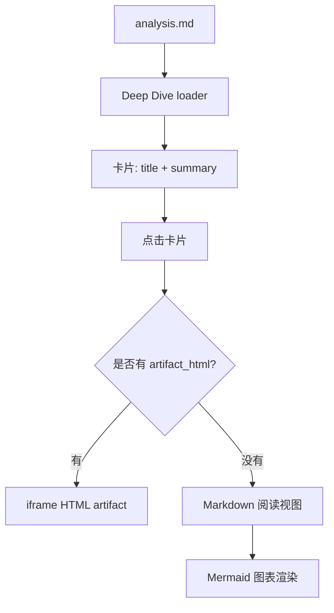

# Mermaid Markdown 测试分析

这是一条临时 mock，用来验证没有 `artifact_html` 的 analysis md 是否会进入 Markdown 阅读视图。

## 数据流

## 验证点

- 卡片应该出现在 Deep Dive 的「精读笔记」里。
- 点击卡片后应该看到这段 Markdown 正文。
- 上面的 Mermaid 代码块应该渲染成图，而不是普通代码块。
