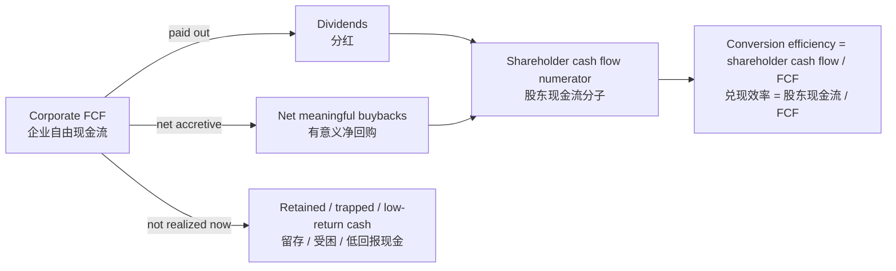

# Core Definition
Shareholder Cash Flow Conversion Efficiency measures how much corporate free cash flow is converted into dividends and economically meaningful buybacks; it is the bridge between enterprise cash generation and shareholder-realized value. Source: [[20260629_manual_shareholder-free-cash-flow-all-cash-is-equal|Re-examining “All cash is equal” through Shareholder Free Cash Flow]]
> 股东现金流兑现效率衡量企业自由现金流中有多少被转化为分红和具备经济意义的回购；它是企业现金创造与股东实际价值兑现之间的桥梁。来源：[[20260629_manual_shareholder-free-cash-flow-all-cash-is-equal|从股东自由现金流角度重审 All cash is equal]]

## 🛠️ Mechanisms & Architecture
The preferred formula is `Conversion efficiency = (Dividends + net meaningful buybacks) / Free cash flow`, while a related payout measure is `(Dividends + net buybacks) / Net income`. Source: [[20260629_manual_shareholder-free-cash-flow-all-cash-is-equal|Re-examining “All cash is equal”]]
> 首选公式是 `兑现效率 = (分红 + 有意义净回购) / 自由现金流`，相关的派现指标则是 `(分红 + 净回购) / 净利润`。来源：[[20260629_manual_shareholder-free-cash-flow-all-cash-is-equal|重审 All cash is equal]]

* **High efficiency:** A high ratio means more of the company’s cash generation is visible and distributable to shareholders, which can justify a higher valuation multiple if durability is credible.
  > **高兑现效率：** 较高比例意味着企业现金创造更多地可见并可分配给股东；若其可持续性可信，可能支撑更高估值倍数。
* **Low efficiency:** A low ratio means reported profit or FCF may be trapped in low-return assets, used for low-quality reinvestment, or controlled by capital-allocation constraints.
  > **低兑现效率：** 较低比例意味着报表利润或 FCF 可能被困在低回报资产中、用于低质量再投资，或受到资本配置约束控制。
* **Buyback adjustment:** Gross repurchase spending should be adjusted for dilution and share cancellation because incentive-offset buybacks do not create the same shareholder economics.
  > **回购调整：** 回购总额应根据稀释和注销情况调整，因为抵消激励稀释的回购并不创造同等股东经济价值。

## ⚔️ Contradictions & Evolution
The source challenges a naive interpretation of “All cash is equal” by arguing that enterprise free cash flow is not automatically equivalent to risk-free cash unless it can become shareholder cash. Source: [[20260629_manual_shareholder-free-cash-flow-all-cash-is-equal|Re-examining “All cash is equal”]]
> 原文挑战了对「All cash is equal」的机械理解，认为企业自由现金流并不自动等同于无风险现金，除非它能够转化为股东现金。来源：[[20260629_manual_shareholder-free-cash-flow-all-cash-is-equal|重审 All cash is equal]]

## 🚀 Implementations & Best Practices
For mature companies, track conversion efficiency together with dividend payout, net buyback payout, net share count change, retained-cash yield, and explicit management capital-return policy.
> 对成熟企业，应把兑现效率与股利支付率、净回购支付率、净股本变化、留存现金收益率和管理层明确资本回报政策一起跟踪。

Use market comparisons carefully: a lower PE may be rational if shareholder cash-flow conversion is structurally lower, while a higher PE may be rational if conversion is high and durable.
> 使用市场比较时要谨慎：如果股东现金流兑现结构性较低，较低 PE 可能合理；如果兑现率高且可持续，较高 PE 也可能合理。

## 📚 Source Mentions
* [[20260629_manual_shareholder-free-cash-flow-all-cash-is-equal|Re-examining “All cash is equal” through Shareholder Free Cash Flow]]

## 🕸️ Relationships

### Related Concepts
[[shareholder-free-cash-flow|Shareholder Free Cash Flow]], [[cash-flow-based-valuation|Cash-Flow-Based Valuation]]
> [[shareholder-free-cash-flow|股东自由现金流]]、[[cash-flow-based-valuation|现金流估值]]

### Related Entities
[[sp-500|S&P 500]], [[a-share-market|A-share Market]], [[coca-cola|Coca-Cola]], [[industrial-and-commercial-bank-of-china|Industrial and Commercial Bank of China]]
> [[sp-500|标普 500]]、[[a-share-market|A 股市场]]、[[coca-cola|可口可乐]]、[[industrial-and-commercial-bank-of-china|工商银行]]
