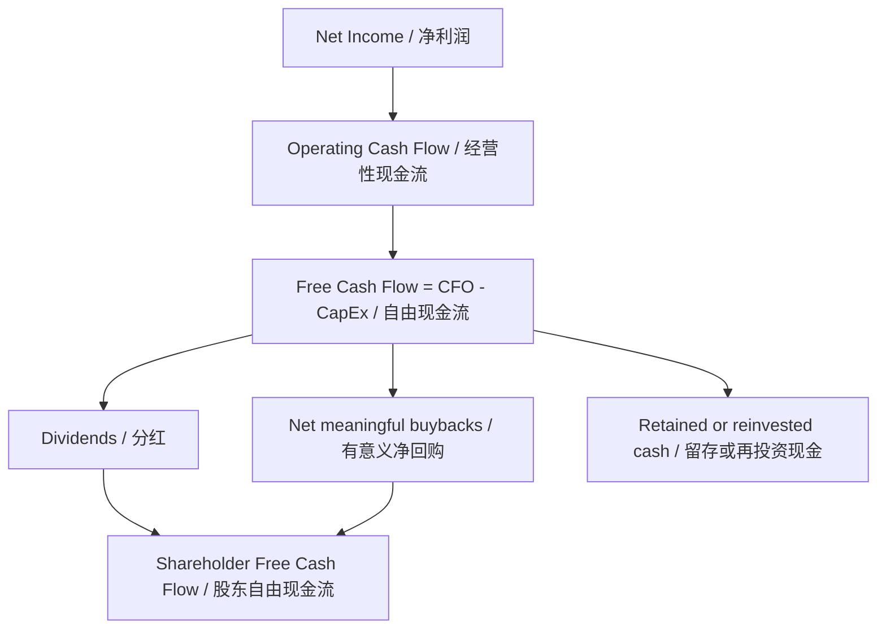

# Core Definition
Shareholder Free Cash Flow is the portion of corporate cash generation that actually reaches shareholders through dividends, economically meaningful buybacks, or liquidation, rather than merely remaining as accounting profit or trapped balance-sheet cash. Source: [[20260629_manual_shareholder-free-cash-flow-all-cash-is-equal|Re-examining “All cash is equal” through Shareholder Free Cash Flow]]
> 股东自由现金流是企业现金创造中真正通过分红、具备经济意义的回购或清算到达股东手中的部分，而不是仅仅停留在会计利润或受困账面现金中。来源：[[20260629_manual_shareholder-free-cash-flow-all-cash-is-equal|从股东自由现金流角度重审 All cash is equal]]

## 🛠️ Mechanisms & Architecture
The mechanism starts with net income, adjusts it into operating cash flow, subtracts CapEx to obtain corporate free cash flow, and then asks what portion of that FCF is converted into dividends or net share-count-reducing buybacks. Source: [[20260629_manual_shareholder-free-cash-flow-all-cash-is-equal|Re-examining “All cash is equal”]]
> 其机制从净利润开始，将其调整为经营性现金流，再扣除 CapEx 得到企业自由现金流，最后追问其中有多少被转化为分红或能够减少净股本的回购。来源：[[20260629_manual_shareholder-free-cash-flow-all-cash-is-equal|重审 All cash is equal]]

* **Dividends:** Cash dividends are the most direct shareholder cash flow because cash leaves the company and reaches all holders proportionally. Source: [[20260629_manual_shareholder-free-cash-flow-all-cash-is-equal|Re-examining “All cash is equal”]]
  > **分红：** 现金分红是最直接的股东现金流，因为现金离开公司并按比例到达所有股东。来源：[[20260629_manual_shareholder-free-cash-flow-all-cash-is-equal|重审 All cash is equal]]
* **Buybacks:** Buybacks count as shareholder cash flow only when they are economically meaningful, especially when they reduce net share count or cancel shares rather than merely offsetting incentive dilution. Source: [[20260629_manual_shareholder-free-cash-flow-all-cash-is-equal|Re-examining “All cash is equal”]]
  > **回购：** 回购只有在具备经济意义时才应计入股东现金流，尤其是能够减少净股本或注销股本，而不只是抵消股权激励稀释。来源：[[20260629_manual_shareholder-free-cash-flow-all-cash-is-equal|重审 All cash is equal]]
* **Retained cash:** Retained cash deserves full value only if it can be reinvested at attractive returns or eventually distributed with low friction. Source: [[20260629_manual_shareholder-free-cash-flow-all-cash-is-equal|Re-examining “All cash is equal”]]
  > **留存现金：** 留存现金只有在能够以有吸引力的回报再投资，或最终以低摩擦方式分配给股东时，才应获得充分估值。来源：[[20260629_manual_shareholder-free-cash-flow-all-cash-is-equal|重审 All cash is equal]]

## ⚔️ Contradictions & Evolution
No contradiction with existing wiki pages was identified during this ingest; the concept refines generic free-cash-flow analysis by adding the shareholder-deliverability constraint.
> 本次 ingest 未发现与既有 wiki 页面冲突；该概念是在通用自由现金流分析之上，加入了「可兑现给股东」这一约束。

## 🚀 Implementations & Best Practices
Use Shareholder Free Cash Flow most heavily for mature, cash-generative companies where growth is no longer the dominant valuation driver.
> 对增长不再是主要估值驱动、且现金创造能力较强的成熟企业，应重点使用股东自由现金流。

Measure buybacks net of dilution and check whether the share count actually falls over time.
> 衡量回购时应扣除稀释，并检查总股本或流通股数是否真的随时间下降。

Do not mechanically deduct cash from enterprise value if cash is structurally trapped, controlled by non-minority-shareholder objectives, or reinvested at low returns.
> 如果现金结构性受困、受非中小股东目标控制，或只能低回报再投资，就不应机械地从企业价值中扣除账面现金。

## 📚 Source Mentions
* [[20260629_manual_shareholder-free-cash-flow-all-cash-is-equal|Re-examining “All cash is equal” through Shareholder Free Cash Flow]]

## 🕸️ Relationships

### Related Concepts
[[shareholder-cash-flow-conversion-efficiency|Shareholder Cash Flow Conversion Efficiency]], [[cash-flow-based-valuation|Cash-Flow-Based Valuation]]
> [[shareholder-cash-flow-conversion-efficiency|股东现金流兑现效率]]、[[cash-flow-based-valuation|现金流估值]]

### Related Entities
[[coca-cola|Coca-Cola]], [[wuliangye|Wuliangye]], [[industrial-and-commercial-bank-of-china|Industrial and Commercial Bank of China]]
> [[coca-cola|可口可乐]]、[[wuliangye|五粮液]]、[[industrial-and-commercial-bank-of-china|工商银行]]
