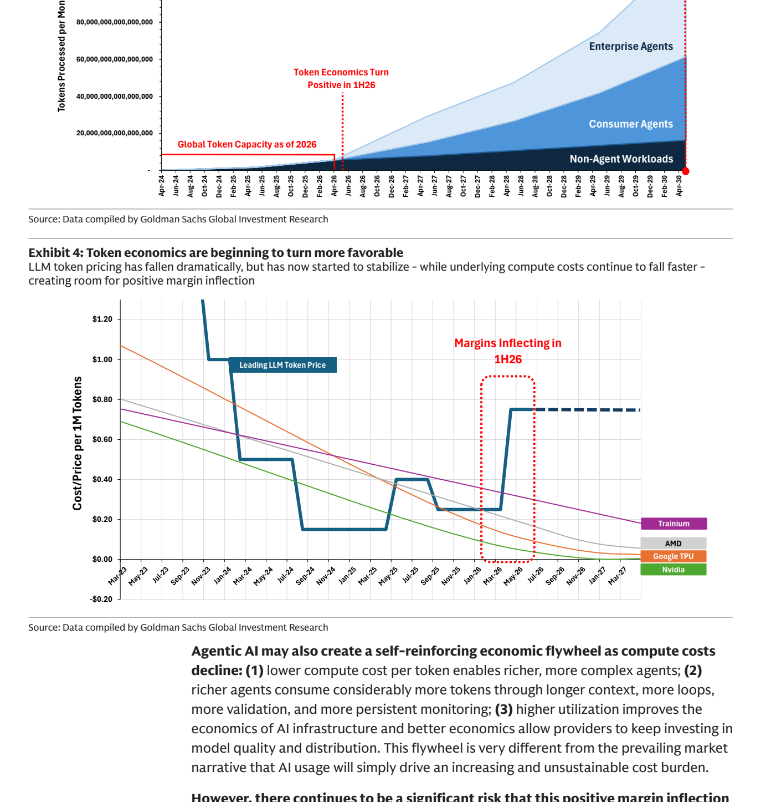
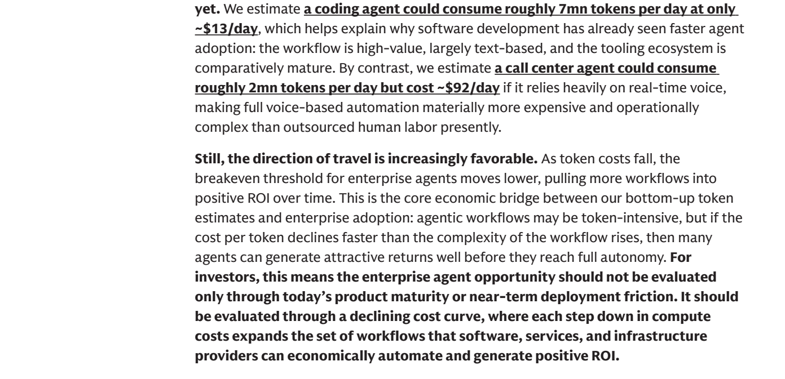
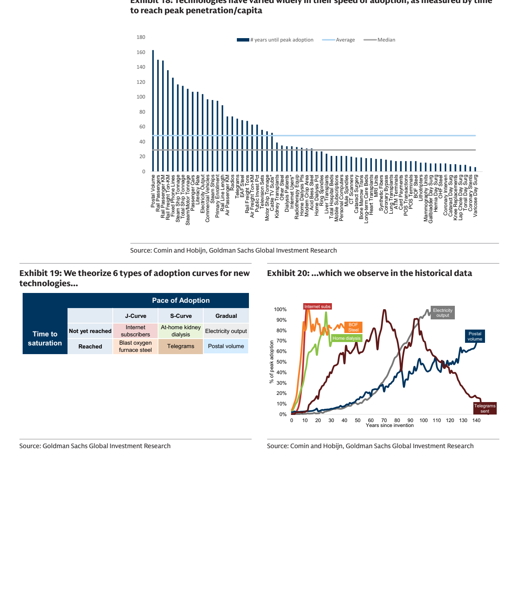

# Americas Technology: Decoding the Agentic Economy
> 《美洲科技：解码 Agentic Economy》

## 📌 TL;DR
> 摘要

* **Agentic AI = token usage explosion + falling token cost** -> AI inference may shift from a **gross-margin drag** to a **gross-margin tailwind**.
  > **Agentic AI = token 用量爆炸 + token 成本下降** -> AI 推理可能从 **毛利拖累** 变成 **毛利增厚**。

## 🎯 Core Investment Proposition
> 核心投资命题

* **One-sentence thesis:** **Agentic AI** is not merely stronger AI adoption -> it is a simultaneous **token demand shock** and **inference margin inflection**.
  > **一句话结论：** **Agentic AI** 不是单纯“AI 更火” -> 而是 **token demand shock** 与 **inference margin inflection** 同时出现。

* **Core logic:** **Agent workflows** -> planning, tool calls, execution, validation, retries, and state updates -> **token consumption multiplies** -> compute utilization improves -> cost per token falls -> **AI usage can become more profitable**.
  > **核心推导：** **Agent 工作流** -> 规划、工具调用、执行、校验、重试、状态更新 -> **token 消耗成倍放大** -> 算力利用率提升 -> 每 token 成本下降 -> **AI usage 可能更赚钱**。

* **Plain-language explanation:** A **chatbot** is like asking a front desk one question; an **agent** is like hiring an assistant who keeps checking, editing, confirming, and executing.
  > **用大白话总结就是：** **Chatbot** 像问前台一个问题；**Agent** 像雇助理，助理会反复查、改、确认、执行。

## 🔢 Core Numbers
> 核心数据

* **2030 token consumption:** roughly **24x** current levels.
  > **2030 年 token 消耗：约 24x 当前水平**。

* **Consumer agents:** roughly **60 quadrillion tokens/month**.
  > **消费者 agents：约 60 quadrillion tokens/month**。

* **Enterprise agents:** roughly **56 quadrillion tokens/month**.
  > **企业 agents：约 56 quadrillion tokens/month**。

* **2040 enterprise peak:** roughly **278 quadrillion tokens/month**, or about **55x** current levels.
  > **2040 年企业峰值：约 278 quadrillion tokens/month，约 55x 当前水平**。

* **Key evidence:** rising token demand + improving token economics -> supports the report's core investment thesis.
  > **关键证据：** token 需求上行 + token economics 转正 -> 支撑报告的核心投资命题。

  

## 🧠 Mechanism
> 机制拆解

* **Chatbot:** one question and one answer -> fewer tokens -> episodic usage pattern.
  > **Chatbot：** 一次问答 -> token 少 -> 使用场景偏 episodic。

* **Agent:** plans, calls tools, executes, validates, retries, and updates state -> more tokens -> workflow usage pattern.
  > **Agent：** 规划、调用工具、执行、校验、重试、更新状态 -> token 多 -> 使用场景偏 workflow。

* **Always-on agent:** monitors in the background -> detects triggers -> acts proactively -> token intensity rises further.
  > **Always-on agent：** 后台持续监控 -> 发现触发条件 -> 主动行动 -> token 强度进一步上升。

* **Plain-language explanation:** A **chatbot** answers when asked; an **agent** is like a house manager watching your email, calendar, tasks, and bills.
  > **用大白话总结就是：** **Chatbot** 是“你问一句它答一句”；**Agent** 是“你请了个管家，他会一直盯邮件、日历、任务和账单”。

## 💰 Why Margins Matter
> 为什么毛利重要

* **Old concern:** more AI usage -> higher inference cost -> heavier CapEx -> hyperscaler margins under pressure.
  > **旧担忧：** AI 用量越大 -> 推理成本越高 -> CapEx 越重 -> 云厂商毛利承压。

* **Goldman's new view:** **token prices** are stabilizing after rapid declines -> **token costs** keep falling through chips, model optimization, caching, and routing.
  > **高盛新判断：** **token 价格** 从快速下跌转向企稳 -> **token 成本** 因芯片、模型优化、缓存、routing 继续下降。

* **Investment implication:** stable prices + falling costs -> **inference gross margin may inflect in 2026**.
  > **投资含义：** 价格稳定 + 成本下降 -> **2026 年可能出现推理毛利拐点**。

* **Risk assessment:** if **token price competition** returns -> cost savings get competed away -> the margin thesis weakens.
  > **风险判断：** 若 **token 价格战** 重启 -> 成本下降被让利吃掉 -> 毛利改善逻辑削弱。

## 🧮 Enterprise ROI
> 企业 ROI 分化

* **Coding agent: roughly 7mn tokens/day, about $13/day** -> text-heavy + strong validation loops -> easiest to scale.
  > **Coding agent：约 7mn tokens/day，约 $13/day** -> 文本为主 + 验证闭环强 -> 最容易落地。

* **Call-center agent: roughly 2mn tokens/day, about $92/day** -> real-time voice is expensive + latency requirements are high -> slower to scale.
  > **Call center agent：约 2mn tokens/day，约 $92/day** -> 实时语音贵 + 低延迟要求高 -> 落地更慢。

* **Data-entry agent: roughly 25mn tokens/day, about $59/day** -> token-heavy but can still be cheaper than human labor.
  > **Data entry agent：约 25mn tokens/day，约 $59/day** -> token 多但仍可能比人工便宜。

* **Key conclusion:** **more tokens does not automatically mean higher cost** -> cost depends on modality, latency, validation burden, and tooling maturity.
  > **关键结论：** **token 多不等于成本高** -> 成本取决于模态、延迟、验证、工具链成熟度。

* **Plain-language explanation:** Coding is like sending many emails, high-volume but cheap; phone support is like a live video meeting, not always word-heavy but every second must be processed instantly.
  > **用大白话总结就是：** 写代码像发很多邮件，量大但便宜；电话客服像实时视频会议，字数不一定多，但每秒都要立刻处理。

  

## 🧭 Adoption Curve
> 采用曲线

* **Current state:** **70%-90%** of enterprises are experimenting with agents, but fewer than **25%** are scaling them.
  > **当前状态：** **70%-90%** 企业在实验 agents，但少于 **25%** 真正规模化。

* **Goldman baseline:** enterprise adoption looks more like an **S-curve** -> about **15 years** to peak -> not overnight universal automation.
  > **高盛基准：** 企业 adoption 更像 **S-curve** -> 约 **15 年** 达峰 -> 不是一夜全面自动化。

* **Bottleneck:** not whether the model can act -> but whether enterprises will allow it to act -> data governance, permissions, auditability, accountability, and process redesign.
  > **瓶颈：** 不是模型会不会做 -> 而是企业敢不敢让它做 -> 数据治理、权限、审计、责任归属、流程重构。

* **Risk assessment:** if governance and process redesign lag -> token demand shifts from an **S-curve** to a flatter linear curve.
  > **风险判断：** 如果企业治理和流程改造慢 -> token demand 曲线从 **S-curve** 变成更平缓的 linear curve。

  

## 🏗️ Beneficiary Stack
> 受益链条

* **Semiconductors:** **Broadcom** -> custom silicon; **Nvidia** -> merchant GPU performance leader; **AMD** -> enterprise CPU/GPU attach.
  > **半导体：** **Broadcom** -> custom silicon；**Nvidia** -> 通用 GPU 性能领导者；**AMD** -> 企业 CPU/GPU attach。

* **Cloud/internet:** **Amazon** -> AWS + Trainium; **Alphabet** -> Google Cloud + TPU + search distribution; **Meta** -> AI-driven advertising and engagement.
  > **云/互联网：** **Amazon** -> AWS + Trainium；**Alphabet** -> Google Cloud + TPU + 搜索分发；**Meta** -> 广告 AI 化 + engagement。

* **Software/services:** **Microsoft** -> Copilot + enterprise workflows; **Cloudflare** -> edge inference; **Accenture** -> integration, governance, and process redesign.
  > **软件/服务：** **Microsoft** -> Copilot + enterprise workflows；**Cloudflare** -> edge inference；**Accenture** -> 集成、治理、流程改造。

## ⚠️ Main Risks
> 主要风险

* **Price-war risk:** token prices keep falling -> margin inflection gets delayed.
  > **价格战风险：** token 价格继续下跌 -> 毛利拐点被推迟。

* **Adoption risk:** enterprises stay in pilot/demo mode -> production token demand disappoints.
  > **采用风险：** 企业停留在 pilot/demo -> 真实生产 token demand 不达预期。

* **Cost risk:** voice, multimodal, and low-latency workflows remain expensive -> some agent ROI does not work.
  > **成本风险：** 语音、多模态、低延迟场景成本高 -> 部分 Agent ROI 不成立。

* **CapEx risk:** compute buildout runs ahead of demand -> depreciation, utilization, and cash-flow pressure rise.
  > **CapEx 风险：** 算力建设过快 -> 折旧、利用率、现金流压力上升。

## 📈 Key Tracking Metrics
> 核心跟踪指标

* **LLM API price trend** -> validates whether token prices are stabilizing.
  > **LLM API price trend** -> 验证 token 价格是否企稳。

* **Cost per 1M tokens** -> validates whether chips, caching, routing, and utilization keep lowering cost.
  > **Cost per 1M tokens** -> 验证芯片、缓存、routing、利用率是否持续降本。

* **Hyperscaler AI gross margin** -> validates whether AI usage is actually margin-accretive.
  > **Hyperscaler AI gross margin** -> 验证 AI 使用是否真的毛利增厚。

* **Production agent adoption** -> validates whether enterprises move from experiments into scaled workflows.
  > **Production agent adoption** -> 验证企业是否从实验进入规模化工作流。

* **Workflow mix** -> validates whether coding/data workflows scale first while voice/multimodal lags.
  > **Workflow mix** -> 验证 coding/data 是否先落地，voice/multimodal 是否滞后。

## 🕸️ Knowledge Graph
> 知识图谱

* **Extracted Entities:** [[goldman-sachs|Goldman Sachs]], [[nvidia|Nvidia]], [[broadcom|Broadcom]], [[amd|AMD]], [[amazon|Amazon]], [[alphabet|Alphabet]], [[meta|Meta]], [[microsoft|Microsoft]], [[cloudflare|Cloudflare]], [[accenture|Accenture]]
  > **提取实体：** [[goldman-sachs|高盛]]、[[nvidia|Nvidia]]、[[broadcom|Broadcom]]、[[amd|AMD]]、[[amazon|Amazon]]、[[alphabet|Alphabet]]、[[meta|Meta]]、[[microsoft|Microsoft]]、[[cloudflare|Cloudflare]]、[[accenture|Accenture]]

* **Related Concepts:** [[ai-agents|AI Agents]], [[ai-inference-economics|AI Inference Economics]], [[ai-capex|AI CapEx]]
  > **相关概念：** [[ai-agents|AI Agent]]、[[ai-inference-economics|AI 推理经济学]]、[[ai-capex|AI 资本开支]]
