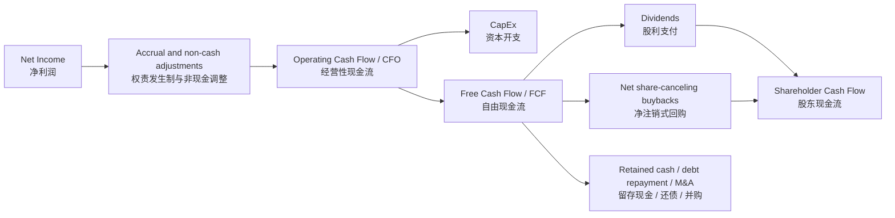

# Re-examining “All cash is equal” through Shareholder Free Cash Flow
> 从股东自由现金流角度，重新审视「All cash is equal」

## 📌 TL;DR
The article argues that mature-company valuation should discount shareholder-deliverable cash flows—dividends plus true buybacks—rather than mechanically valuing accounting profit or corporate cash at risk-free-rate multiples.
> 文章认为，成熟企业估值应折现真正能兑现给股东的现金流——分红加真实回购——而不是机械地用无风险利率倍数给会计利润或企业账面现金估值。

## 🎯 Core Investment Proposition
The source’s central proposition is that “All cash is equal” only applies when corporate free cash flow can become cash in shareholders’ pockets through dividends, share-canceling buybacks, or liquidation; it does not mean “all profit is equal.”
> 本文的核心命题是：「All cash is equal」只适用于企业自由现金流能够通过分红、注销式回购或清算变成股东口袋里的现金；它并不等于「所有利润都是等价的」。

For mature companies, the source argues that valuation should shift from net-profit certainty and headline PE toward [[shareholder-free-cash-flow|Shareholder Free Cash Flow]] and [[shareholder-cash-flow-conversion-efficiency|Shareholder Cash Flow Conversion Efficiency]].
> 对成熟企业而言，本文认为估值重心应从净利润确定性和表观 PE，转向 [[shareholder-free-cash-flow|股东自由现金流]] 与 [[shareholder-cash-flow-conversion-efficiency|股东现金流兑现效率]]。

## 🧮 Term Relationships and Calculations
The accounting-to-shareholder-cash chain can be summarized as net income becoming operating cash flow after accrual and non-cash adjustments, operating cash flow becoming free cash flow after CapEx, and free cash flow becoming shareholder cash flow only when it is actually distributed through dividends or economically meaningful buybacks.
> 从会计利润到股东现金的链条可以概括为：净利润经过权责发生制和非现金项目调整后变成经营性现金流，经营性现金流扣除 CapEx 后变成自由现金流，而自由现金流只有在通过分红或具备经济意义的回购真正分配时，才变成股东现金流。



The same relationship can be displayed as a capital-allocation Sankey diagram, where FCF is the cash pool and only dividends plus real buybacks become immediate shareholder cash flow.
> 同一关系也可以用资本配置桑基图表示：FCF 是现金池，只有分红加真实回购才会成为即时的股东现金流。

```mermaid
sankey-beta

Net Income 净利润,Operating Cash Flow CFO 经营性现金流,100
Non-cash/accrual adjustments 非现金与权责调整,Operating Cash Flow CFO 经营性现金流,20
Operating Cash Flow CFO 经营性现金流,CapEx 资本开支,40
Operating Cash Flow CFO 经营性现金流,Free Cash Flow FCF 自由现金流,80
Free Cash Flow FCF 自由现金流,Dividends 股利支付,25
Free Cash Flow FCF 自由现金流,Buybacks 回购,35
Free Cash Flow FCF 自由现金流,Retained/Other 留存或其他用途,20
Dividends 股利支付,Shareholder Cash Flow 股东现金流,25
Buybacks 回购,Shareholder Cash Flow 股东现金流,35
```

The core formulas preserved from the source and the follow-up discussion are these calculation rules.
> 从原文及后续讨论中保留下来的核心公式如下。

| Metric | Formula | Interpretation |
|---|---|---|
| Operating cash flow | `CFO = Net income + non-cash expenses - non-operating gains ± working-capital changes` | Converts accrual accounting profit into operating cash. |
| Free cash flow | `FCF = CFO - CapEx` | Measures cash left after maintaining or expanding the asset base. |
| Shareholder cash flow | `SCF = Dividends + net economically meaningful buybacks` | Measures cash actually returned to shareholders. |
| Dividend payout ratio | `Dividends / Net income` | Measures how much accounting profit is paid as dividends. |
| Buyback payout ratio | `Net buybacks / Net income` | Measures how much accounting profit is used for buybacks. |
| Total shareholder payout ratio | `(Dividends + Net buybacks) / Net income` | Measures shareholder return versus accounting profit. |
| FCF-to-shareholder conversion efficiency | `(Dividends + Net meaningful buybacks) / FCF` | Measures how efficiently corporate FCF becomes shareholder cash flow. |
| Dividend yield | `Dividends / Market capitalization` | Measures cash dividend yield on market value. |
| Dividend multiple | `Market capitalization / Dividends = 1 / Dividend yield = PE / dividend payout ratio` | Explains why a bank can have a sub-10 PE but a roughly 25x dividend multiple. |
| Growing perpetuity value | `Fair market value = SCF × (1 + g) / (r - g)` | Values shareholder cash flow when long-term growth `g` and required return `r` are explicit. |
> | 指标 | 公式 | 含义 |
> |---|---|---|
> | 经营性现金流 | `CFO = 净利润 + 非现金费用 - 非经营性收益 ± 营运资本变化` | 把权责发生制会计利润调整为经营现金。 |
> | 自由现金流 | `FCF = CFO - CapEx` | 衡量维持或扩张资产基础后剩余的现金。 |
> | 股东现金流 | `SCF = 分红 + 具有经济意义的净回购` | 衡量真正返还给股东的现金。 |
> | 股利支付率 | `分红 / 净利润` | 衡量会计利润中有多少用于分红。 |
> | 回购支付率 | `净回购 / 净利润` | 衡量会计利润中有多少用于回购。 |
> | 股东总回报率 | `(分红 + 净回购) / 净利润` | 衡量股东回报相对于会计利润的比例。 |
> | FCF 向股东现金流转化效率 | `(分红 + 有意义净回购) / FCF` | 衡量企业 FCF 转化为股东现金流的效率。 |
> | 股息率 | `分红 / 市值` | 衡量市值对应的现金分红收益率。 |
> | 股息倍数 | `市值 / 分红 = 1 / 股息率 = PE / 股利支付率` | 解释为什么银行 PE 可以低于 10，但股息倍数接近 25 倍。 |
> | 永续增长估值 | `合理市值 = 股东现金流 × (1 + g) / (r - g)` | 在显式给定长期增长率 `g` 与要求回报率 `r` 时估值股东现金流。 |

## 🔍 Critical Breakdown
* **Argument:** Corporate cash and accounting profit deserve bond-like valuation only when they can be transformed into shareholder cash without major friction, leakage, or low-return reinvestment.
  > **论点：** 企业现金和会计利润只有在能够无明显摩擦、损耗或低效再投资地转化为股东现金时，才应获得类似债券现金流的估值。
  * **Evidence:** The source contrasts the S&P 500’s high dividends-plus-buybacks return mechanism with A-share companies’ lower total shareholder return ratio and weaker cancellation-style buybacks.
    > **证据：** 原文对比了标普 500 较高的分红加回购返还机制，与 A 股较低的股东总回报比例以及较弱的注销式回购。
  * **Evidence Quality:** Partial — the article provides directional market-level figures, but the wiki should treat them as author-supplied claims unless independently verified.
    > **证据质量：** 部分成立——文章提供了方向性的市场层面数字，但在未经独立核验前，本 wiki 应把它们视为作者口径。
  * **Missing Variables:** Tax treatment, leverage, regulatory capital constraints, cyclicality, governance quality, minority-shareholder protection, and whether buybacks are net of dilution.
    > **缺失变量：** 税务处理、杠杆、监管资本约束、周期性、治理质量、中小股东保护，以及回购是否扣除了股权激励稀释。
  * **Independent Assessment:** Directionally agree — the distinction between enterprise FCF and shareholder-deliverable FCF is a useful correction to naive PE-based valuation.
    > **独立判断：** 方向上同意——区分企业 FCF 与可兑现给股东的 FCF，是对机械 PE 估值的一种有用修正。

* **Argument:** Mature companies lose the “growth covers all sins” shield; once growth slows, shareholder cash-flow realization becomes a primary valuation driver.
  > **论点：** 成熟企业会失去「增长遮羞布」；一旦增长放缓，股东现金流兑现效率就会成为核心估值驱动因素。
  * **Evidence:** The article uses [[coca-cola|Coca-Cola]], [[yum-china|Yum China]], and [[hong-kong-exchanges-and-clearing|Hong Kong Exchanges and Clearing]] as examples where high shareholder-return intensity supports richer valuation despite modest growth.
    > **证据：** 文章以 [[coca-cola|可口可乐]]、[[yum-china|百胜中国]] 和 [[hong-kong-exchanges-and-clearing|港交所]] 为例，说明即使增长不高，高股东回报强度也能支撑较高估值。
  * **Evidence Quality:** Partial — examples are coherent with the thesis, but they are not a full regression controlling for quality, duration, and risk.
    > **证据质量：** 部分成立——案例与论点一致，但并非控制了质量、久期和风险后的完整回归证明。
  * **Missing Variables:** Brand durability, pricing power, reinvestment runway, payout tax friction, and sector-specific risk premiums.
    > **缺失变量：** 品牌耐久性、定价权、再投资空间、派现税负摩擦，以及行业特定风险溢价。
  * **Independent Assessment:** Agree with caution — the framework is strongest for mature, cash-generative companies and weaker for genuinely high-ROIC reinvestment stories.
    > **独立判断：** 谨慎同意——该框架最适用于成熟且现金创造能力强的企业，对真正具备高 ROIC 再投资机会的成长企业适用性较弱。

* **Argument:** Buyback quality matters because incentive-offset buybacks do not create the same per-share economics as cancellation-style buybacks.
  > **论点：** 回购质量很重要，因为用于抵消股权激励稀释的回购，与注销式回购并不创造同等的每股经济价值。
  * **Evidence:** The article distinguishes U.S. cancellation-oriented buybacks from many A-share buybacks used for employee equity incentives.
    > **证据：** 原文区分了美股偏注销导向的回购，以及许多 A 股用于员工股权激励的回购。
  * **Evidence Quality:** Strong as a conceptual distinction, partial as a market-wide empirical claim.
    > **证据质量：** 作为概念区分较强，作为全市场实证判断则仍属部分成立。
  * **Missing Variables:** Net share count change, average repurchase price, dilution from stock-based compensation, and cancellation versus treasury-stock treatment.
    > **缺失变量：** 净股本变化、平均回购价格、股权激励带来的稀释，以及注销股本与库存股处理方式的区别。
  * **Independent Assessment:** Agree — buybacks should be measured by net share count reduction and per-share FCF accretion, not gross announced amount.
    > **独立判断：** 同意——回购应看净股本下降和每股 FCF 增厚，而不是公告回购总额。

## 👻 Implicit Assumptions
The framework assumes that minority shareholders can evaluate and eventually receive value from distributable cash; weak governance, state ownership constraints, or controlling-shareholder preferences may reduce the practical value of balance-sheet cash.
> 该框架假设中小股东能够评估并最终获得可分配现金的价值；治理薄弱、国有股东约束或控股股东偏好，都可能降低账面现金的实际价值。

The framework also assumes that low-return retained cash should not be valued at face value when management lacks a clear plan to distribute it or reinvest it at attractive returns.
> 该框架还假设，如果管理层没有明确分配现金或以有吸引力回报再投资的计划，低收益留存现金就不应简单按面值估值。

## ⚡ Expectation Gap (预期差)
* **Priced In:** Many investors already understand PE, dividend yield, and free cash flow, and the market often gives mature cash-return machines higher valuation multiples.
  > **已定价认知：** 很多投资者已经理解 PE、股息率和自由现金流，市场也常常给予成熟现金回报机器更高估值倍数。
* **Marginal Info:** The sharper edge is the conversion bridge from enterprise FCF to shareholder cash flow and the distinction between gross buyback activity and true per-share value creation.
  > **边际信息：** 更有增量的部分，是从企业 FCF 到股东现金流的转化桥，以及区分总回购动作与真正每股价值创造。
* **Valuation implication:** A low PE may be justified if payout is structurally low, while a higher PE may be justified if shareholder cash-flow realization is high, durable, and growing.
  > **估值含义：** 如果派现结构性偏低，低 PE 可能合理；如果股东现金流兑现率高、可持续且增长，高 PE 也可能合理。

## 📈 Key Tracking Metrics
1. Dividend payout ratio: `Dividends / Net income`.
   > 股利支付率：`分红 / 净利润`。
2. Net buyback payout ratio: `Net buybacks / Net income`, adjusted for share-based compensation dilution.
   > 净回购支付率：`净回购 / 净利润`，并应调整股权激励带来的稀释。
3. Total shareholder payout ratio: `(Dividends + Net buybacks) / Net income`.
   > 股东总回报率：`(分红 + 净回购) / 净利润`。
4. FCF-to-shareholder conversion efficiency: `(Dividends + Net meaningful buybacks) / FCF`.
   > FCF 向股东现金流转化效率：`(分红 + 有意义净回购) / FCF`。
5. Net share count change and per-share FCF growth.
   > 净股本变化与每股 FCF 增长。
6. Cash yield on retained capital and explicit capital-return policy.
   > 留存资本现金收益率与明确的资本回报政策。

## 🧭 Case Notes Preserved from the Source
[[coca-cola|Coca-Cola]] is presented as a mature company whose high dividends-plus-buybacks return ratio helped support PE expansion and sustained valuation despite limited profit growth.
> [[coca-cola|可口可乐]] 被呈现为成熟企业案例：即使利润增长有限，其高分红加回购返还比例仍帮助支撑 PE 扩张和稳定估值。

[[wuliangye|Wuliangye]] is used to illustrate that large balance-sheet cash earning low deposit returns should not automatically be subtracted from market capitalization at face value if it is not clearly distributable to shareholders.
> [[wuliangye|五粮液]] 用来说明：如果巨额账面现金仅获取低存款收益且缺乏明确分配路径，就不应简单按面值从市值中扣除。

[[industrial-and-commercial-bank-of-china|Industrial and Commercial Bank of China]] is used to show why a bank can have a low PE but still trade at roughly a 24–25x dividend multiple: `Dividend multiple = PE / dividend payout ratio = 1 / dividend yield`.
> [[industrial-and-commercial-bank-of-china|工商银行]] 用来说明银行可以同时具有低 PE 和约 24–25 倍股息倍数：`股息倍数 = PE / 股利支付率 = 1 / 股息率`。

## ⚠️ Caveats / Open Questions
The article’s market-level figures for 2025 and 2026 should be treated as source claims until separately verified against primary market data.
> 文章中关于 2025 与 2026 的市场层面数字，在单独用一手市场数据核验前，应视为原文口径。

The framework does not reject reinvestment; it penalizes low-return or trapped reinvestment while still allowing high-ROIC retained capital to deserve premium valuation.
> 该框架并不否定再投资；它惩罚的是低回报或被困住的再投资，同时仍承认高 ROIC 留存资本可以获得溢价估值。


## 🧩 Structured HTML Artifact
A standalone HTML artifact was created to preserve the terminology map, calculation formulas, shareholder-cash-flow conversion framework, and ICBC dividend-multiple bridge. See [[20260629_manual_shareholder-cash-flow-valuation-map|Shareholder Cash Flow Valuation Map]].
> 已创建一份独立 HTML artifact，用于保存术语关系图、计算公式、股东现金流兑现框架以及工商银行股息倍数桥梁。见 [[20260629_manual_shareholder-cash-flow-valuation-map|股东现金流估值地图]]。

## 🕸️ Knowledge Graph
**Extracted Entities:** [[warren-buffett|Warren Buffett]], [[berkshire-hathaway|Berkshire Hathaway]], [[coca-cola|Coca-Cola]], [[kweichow-moutai|Kweichow Moutai]], [[wuliangye|Wuliangye]], [[yum-china|Yum China]], [[hong-kong-exchanges-and-clearing|Hong Kong Exchanges and Clearing]], [[industrial-and-commercial-bank-of-china|Industrial and Commercial Bank of China]], [[bank-of-america|Bank of America]], [[wells-fargo|Wells Fargo]], [[sp-500|S&P 500]], [[csi-300|CSI 300]], [[a-share-market|A-share Market]]
> **抽取实体：** [[warren-buffett|Warren Buffett]]、[[berkshire-hathaway|Berkshire Hathaway]]、[[coca-cola|可口可乐]]、[[kweichow-moutai|贵州茅台]]、[[wuliangye|五粮液]]、[[yum-china|百胜中国]]、[[hong-kong-exchanges-and-clearing|港交所]]、[[industrial-and-commercial-bank-of-china|工商银行]]、[[bank-of-america|美国银行]]、[[wells-fargo|富国银行]]、[[sp-500|标普 500]]、[[csi-300|沪深 300]]、[[a-share-market|A 股市场]]。

**Related Concepts:** [[shareholder-free-cash-flow|Shareholder Free Cash Flow]], [[shareholder-cash-flow-conversion-efficiency|Shareholder Cash Flow Conversion Efficiency]], [[cash-flow-based-valuation|Cash-Flow-Based Valuation]]
> **相关概念：** [[shareholder-free-cash-flow|股东自由现金流]]、[[shareholder-cash-flow-conversion-efficiency|股东现金流兑现效率]]、[[cash-flow-based-valuation|现金流估值]]。
